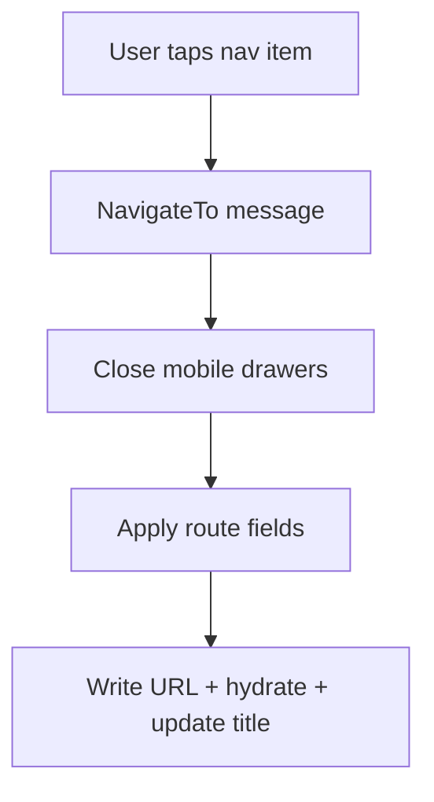

# Responsive System

This document describes the responsive layout system and breakpoints used by the
ScrumBringer client.

## Breakpoints

The UI uses a consistent, mobile-first set of breakpoints:

- **sm (640px)**: Small mobile layouts
- **md (768px)**: Mobile/tablet layouts
- **lg (1024px)**: Tablet / small desktop layouts

CSS media queries should only use these values for max-width rules.

## Core Components

### MobileDrawerState

`client_state.gleam`

- `DrawerClosed`
- `DrawerLeftOpen`
- `DrawerRightOpen`

Helpers:

- `toggle_left_drawer(state)`
- `toggle_right_drawer(state)`
- `close_drawers(state)`

### Responsive Drawer

`features/layout/responsive_drawer.gleam`

`view(is_open, position, on_close, content)` renders the overlay and drawer
content. The drawer always renders; CSS controls visibility with the
`drawer-open` class.

Positions:

- `Left`
- `Right`

### Three Panel Layout

`features/layout/three_panel_layout.gleam`

Layout config builder for the 3-panel structure (nav, main, aside) with
ARIA landmarks and data-testid attributes for E2E.

### Mobile Shell

`client_view.gleam` exposes `view_mobile_shell()` which composes:

- Mobile header
- Mini task bar
- Left/right drawers

## Behavior by Viewport

| Range | Behavior |
| --- | --- |
| <= 640px | Single column, mobile header visible, drawers used for nav/panels |
| <= 768px | Mobile layout, touch targets >= 44px, drawers active |
| <= 1024px | Reduced panel density, right panel hidden when needed |
| > 1024px | Full 3-panel layout |

## Drawer Navigation Flow

## Testing

### Unit

- `responsive_drawer_test.gleam`
- `mobile_drawer_state_test.gleam`
- `three_panel_layout_test.gleam`

### E2E (Playwright)

- 375x667 (iPhone SE)
- 768x1024 (iPad)

Check:

- Mobile header visibility
- Drawer open/close
- No horizontal overflow
- Breakpoint transitions
