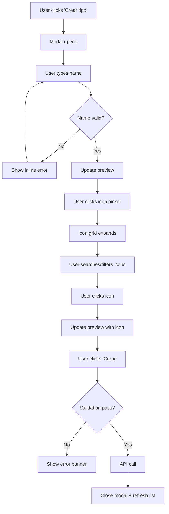

# UI/UX Specification: Task Type CRUD Dialog Improvements

**Version:** 1.0
**Date:** 2026-01-26
**Author:** Sally (UX Expert)
**Component:** `task_type_crud_dialog.gleam`

---

## 1. Introduction

### 1.1 Purpose

This specification details UX improvements for the "Crear tipo de tarea" (Create Task Type) modal dialog. The goal is to enhance usability by replacing a text-based dropdown with a visual icon picker, adding real-time preview, and improving form feedback.

### 1.2 Current State Analysis

| Issue | Severity | User Impact |
|-------|----------|-------------|
| Icon selector shows technical text (`clipboard-document-list`) | High | Users cannot visualize icons before selection |
| No preview of final result | Medium | Users must guess how the type will appear |
| Generic placeholder | Low | Doesn't guide users with examples |
| No character limit feedback | Low | Unclear input constraints |

### 1.3 Success Criteria

- Users can visually browse and select icons without reading technical names
- Users see real-time preview of their task type as they create it
- Form validation provides immediate, inline feedback
- Accessibility remains WCAG AA compliant

---

## 2. User Flow

### 2.1 Improved Create Task Type Flow



### 2.2 Edge Cases

| Scenario | Handling |
|----------|----------|
| Name exceeds max length | Counter turns red, submit disabled |
| Duplicate name | API returns 409, show "Name already exists" |
| Icon search has no results | Show "No icons found" + reset option |
| Network error on submit | Show error banner, keep form data |

---

## 3. Component Specifications

### 3.1 Preview Component (NEW)

**Purpose:** Show real-time visualization of the task type being created.

**Location:** Above the form fields, below the dialog header.

```
+-------------------------------------------+
|  Vista previa:                            |
|  +--------------------------------------+ |
|  |  [icon]  Nombre del tipo             | |
|  +--------------------------------------+ |
+-------------------------------------------+
```

**States:**

| State | Appearance |
|-------|------------|
| Empty (no name) | Icon placeholder + "Nombre del tipo" in muted text |
| Name entered | Icon + actual name in normal text |
| Icon selected | Selected icon + name |
| Both filled | Full preview with actual values |

**Implementation:**

```gleam
// New helper in task_type_crud_dialog.gleam
fn view_preview(icon_id: String, name: String, theme: Theme) -> Element(Msg) {
  let display_name = case string.trim(name) {
    "" -> "Nombre del tipo"
    n -> n
  }
  let name_class = case string.trim(name) {
    "" -> "preview-placeholder"
    _ -> "preview-name"
  }

  div([class("task-type-preview")], [
    span([class("preview-label")], [text("Vista previa:")]),
    div([class("preview-content")], [
      icon_catalog.render(icon_id, 24),
      span([class(name_class)], [text(display_name)])
    ])
  ])
}
```

**CSS:**

```css
.task-type-preview {
  background: var(--sb-elevated);
  border-radius: 8px;
  padding: 12px;
  margin-bottom: 16px;
}

.preview-label {
  font-size: 12px;
  color: var(--sb-muted);
  margin-bottom: 8px;
  display: block;
}

.preview-content {
  display: flex;
  align-items: center;
  gap: 8px;
  padding: 8px 12px;
  background: var(--sb-surface);
  border-radius: 6px;
  border: 1px solid var(--sb-border);
}

.preview-placeholder {
  color: var(--sb-muted);
  font-style: italic;
}
```

---

### 3.2 Icon Picker Integration

**Purpose:** Replace dropdown with visual grid using existing `icon_picker` component.

**Current (to remove):**
```gleam
// Dropdown showing technical text
ui.select([...], [
  option([value("clipboard-document-list")], "clipboard-document-list"),
  // ...more options
])
```

**Proposed (using existing component):**
```gleam
// Visual grid with search and categories
icon_picker.view(
  model.create_icon,
  fn(icon_id) { UserSelectedIcon(icon_id) }
)
```

**Behavior:**

1. Initially shows collapsed state with selected icon
2. Click expands to full grid
3. Search input filters icons by label
4. Category tabs filter by category
5. Click icon selects and collapses picker

**Existing Code to Reuse:**

| File | Function | Purpose |
|------|----------|---------|
| `ui/icon_picker.gleam` | `view()` | Full picker component |
| `ui/icon_catalog.gleam` | `search()` | Filter by query |
| `ui/icon_catalog.gleam` | `by_category()` | Filter by category |
| `ui/icon_catalog.gleam` | `render()` | Display single icon |

---

### 3.3 Name Input with Character Counter

**Purpose:** Show remaining characters and provide immediate validation feedback.

**Specifications:**

| Property | Value |
|----------|-------|
| Max length | 30 characters (suggested, verify with backend) |
| Min length | 1 character (required) |
| Validation | Trim whitespace, non-empty |

**Layout:**

```
+-------------------------------------------+
| Nombre *                          12/30   |
| +---------------------------------------+ |
| | Bug de rendimiento                    | |
| +---------------------------------------+ |
+-------------------------------------------+
```

**States:**

| State | Counter Color | Border Color | Message |
|-------|---------------|--------------|---------|
| Empty | Muted | Default | - |
| Valid (< 25) | Muted | Default | - |
| Warning (25-30) | Warning | Warning | - |
| Over limit (> 30) | Error | Error | "Nombre demasiado largo" |
| Submitted empty | Error | Error | "El nombre es requerido" |

**Implementation:**

```gleam
fn view_name_input_with_counter(
  name: String,
  max_len: Int,
  error: Option(String),
  locale: Locale
) -> Element(Msg) {
  let current_len = string.length(name)
  let counter_class = case current_len {
    n if n > max_len -> "char-counter over-limit"
    n if n > max_len - 5 -> "char-counter warning"
    _ -> "char-counter"
  }
  let input_class = case error, current_len > max_len {
    Some(_), _ -> "input-error"
    _, True -> "input-error"
    _, _ -> ""
  }

  div([class("form-group")], [
    div([class("form-group-header")], [
      label([], [
        text(i18n_t(locale, i18n_text.Name)),
        span([class("required")], [text(" *")])
      ]),
      span([class(counter_class)], [
        text(int.to_string(current_len) <> "/" <> int.to_string(max_len))
      ])
    ]),
    input([
      attribute.type_("text"),
      attribute.class(input_class),
      attribute.value(name),
      attribute.placeholder("Ej: Bug, Historia, Mejora..."),
      attribute.maxlength(max_len),
      event.on_input(UserTypedCreateName)
    ]),
    case error {
      Some(msg) -> span([class("field-error")], [text(msg)])
      None -> element.none()
    }
  ])
}
```

**CSS:**

```css
.form-group-header {
  display: flex;
  justify-content: space-between;
  align-items: center;
  margin-bottom: 6px;
}

.char-counter {
  font-size: 12px;
  color: var(--sb-muted);
}

.char-counter.warning {
  color: var(--sb-warning);
}

.char-counter.over-limit {
  color: var(--sb-danger);
  font-weight: 500;
}

.field-error {
  font-size: 12px;
  color: var(--sb-danger);
  margin-top: 4px;
  display: block;
}
```

---

### 3.4 Improved Placeholder

**Current:**
```gleam
attribute.placeholder("Nombre del tipo")
```

**Proposed:**
```gleam
attribute.placeholder("Ej: Bug, Historia, Mejora...")
```

**Rationale:** Provides concrete examples that guide the user without being prescriptive.

---

## 4. Complete Dialog Layout

### 4.1 Create Mode

```
+-------------------------------------------+
|  Crear tipo de tarea                   X  |
+-------------------------------------------+
|                                           |
|  Vista previa:                            |
|  +--------------------------------------+ |
|  |  [icon]  Bug de rendimiento          | |
|  +--------------------------------------+ |
|                                           |
|  Nombre *                          12/30  |
|  +--------------------------------------+ |
|  | Bug de rendimiento                   | |
|  +--------------------------------------+ |
|                                           |
|  Icono                                    |
|  +--------------------------------------+ |
|  | [search input                      ] | |
|  | [Tasks] [Status] [Objects] [Actions] | |
|  | +--+ +--+ +--+ +--+ +--+ +--+       | |
|  | |  | |  | |  | |  | |  | |  |       | |
|  | +--+ +--+ +--+ +--+ +--+ +--+       | |
|  +--------------------------------------+ |
|                                           |
|          [Cancelar]  [Crear]              |
+-------------------------------------------+
```

### 4.2 Edit Mode

Same layout with:
- Title: "Editar tipo de tarea"
- Fields pre-populated
- Button: "Guardar" instead of "Crear"

### 4.3 Delete Mode (unchanged)

Current implementation is adequate.

---

## 5. Accessibility Requirements

### 5.1 Keyboard Navigation

| Key | Action |
|-----|--------|
| Tab | Move between form fields |
| Enter | Select focused icon / Submit form |
| Escape | Close picker / Close dialog |
| Arrow keys | Navigate icon grid |
| Space | Select focused icon |

### 5.2 ARIA Attributes

```gleam
// Icon picker grid
div([
  attribute("role", "listbox"),
  attribute("aria-label", "Seleccionar icono")
], icons)

// Individual icon
button([
  attribute("role", "option"),
  attribute("aria-selected", is_selected),
  attribute("aria-label", icon.label)
], [icon_view])

// Preview region
div([
  attribute("role", "status"),
  attribute("aria-live", "polite"),
  attribute("aria-label", "Vista previa del tipo de tarea")
], preview_content)
```

### 5.3 Color Contrast

| Element | Foreground | Background | Ratio | Status |
|---------|------------|------------|-------|--------|
| Counter (normal) | `--sb-muted` | `--sb-surface` | 4.5:1+ | Pass |
| Counter (error) | `--sb-danger` | `--sb-surface` | 4.5:1+ | Verify |
| Selected icon | `--sb-primary-fg` | `--sb-primary` | 4.5:1+ | Pass |

---

## 6. Implementation Checklist

### Phase 1: Quick Wins (30 min)

- [ ] Update placeholder text to "Ej: Bug, Historia, Mejora..."
- [ ] Add `maxlength` attribute to name input

### Phase 2: Icon Picker (45 min)

- [ ] Import `icon_picker` module
- [ ] Replace dropdown with `icon_picker.view()`
- [ ] Handle `IconSelected(String)` message
- [ ] Test keyboard navigation

### Phase 3: Preview (30 min)

- [ ] Create `view_preview()` helper
- [ ] Add CSS for preview component
- [ ] Integrate in dialog body (above form fields)
- [ ] Test with screen reader

### Phase 4: Character Counter (30 min)

- [ ] Create `view_name_input_with_counter()` helper
- [ ] Add CSS for counter states
- [ ] Add validation logic for max length
- [ ] Update submit validation

### Phase 5: Testing & Polish (30 min)

- [ ] Test all keyboard interactions
- [ ] Verify ARIA attributes
- [ ] Test with screen reader (VoiceOver/NVDA)
- [ ] Verify responsive behavior
- [ ] Cross-browser testing

---

## 7. Files to Modify

| File | Changes |
|------|---------|
| `components/task_type_crud_dialog.gleam` | Main implementation |
| `ui/styles.gleam` | Add CSS for preview, counter |
| `i18n/text.gleam` | Add new translation keys |
| `i18n/en.gleam` | English translations |
| `i18n/es.gleam` | Spanish translations |

### 7.1 New i18n Keys

```gleam
// In text.gleam
pub type Text {
  // ... existing
  PreviewLabel        // "Vista previa" / "Preview"
  NameTooLong         // "Nombre demasiado largo" / "Name too long"
  ExamplePlaceholder  // "Ej: Bug, Historia, Mejora..." / "E.g.: Bug, Story, Enhancement..."
}
```

---

## 8. Design Tokens Reference

Existing CSS variables to use:

```css
--sb-primary: #0d9488;      /* Teal - primary actions */
--sb-surface: #ffffff;       /* Card backgrounds */
--sb-elevated: #f8fafc;      /* Elevated surfaces */
--sb-border: #e2e8f0;        /* Borders */
--sb-muted: #64748b;         /* Secondary text */
--sb-danger: #dc2626;        /* Errors */
--sb-warning: #f59e0b;       /* Warnings */
--sb-text: #0f172a;          /* Primary text */
```

---

## 9. Change Log

| Date | Version | Description | Author |
|------|---------|-------------|--------|
| 2026-01-26 | 1.0 | Initial specification | Sally (UX Expert) |
