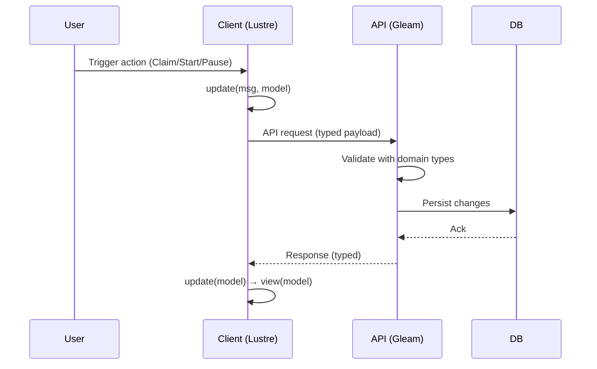

# Sprint 3 Refactor Checklist Architecture Document

## Document Objectives

This document defines the architecture objectives for Sprint 3 refactoring work, focusing on maintainability, modular structure, and development hygiene. The objectives are:

1. **Eliminate duplication in view/update** by consolidating shared logic and reducing repeated patterns across modules.
2. **Remove legacy `api.gleam` and migrate to `api/*`**, establishing a clear and extensible API boundary.
3. **Improve organization and maintainability** through coherent module grouping, consistent naming, and reduced cross-module coupling.
4. **Enforce strict hygiene rules**:
   - Files must be **≤100 lines** unless explicitly justified.
   - Each module must include **`////` module docs**.
   - Each public function must include **`///` doc comments with examples**.
5. **Testing standards**: all changes must pass `make test` and `gleam test`.

## Introduction

This document outlines the overall project architecture for **Sprint 3 Refactor**, including backend systems, shared services, and non‑UI specific concerns. Its primary goal is to serve as the guiding architectural blueprint for AI-driven development, ensuring consistency and adherence to chosen patterns and technologies.

**Relationship to Frontend Architecture:**
If the project includes a significant user interface, a separate Frontend Architecture Document will detail the frontend-specific design and MUST be used in conjunction with this document. Core technology stack choices documented herein (see “Tech Stack”) are definitive for the entire project, including any frontend components.

### Starter Template or Existing Project

**Decision:** Existing codebase refactor (no starter template).
**Architecture basis:** `docs/brief.md`.

**Guiding references to incorporate:**
- **Gleam + Lustre guidance** (for client architecture and TEA patterns).
- **“Bulletproof Type Safety” article** (type-driven design and invariants).

### Change Log

| Date | Version | Description | Author |
| --- | --- | --- | --- |
| 2026-01-17 | 1.0 | Initial Sprint 3 refactor architecture checklist | Winston |

## High Level Architecture

### Technical Summary
ScrumBringer remains a **two-tier architecture**: a **Lustre client (TEA, target=JavaScript)** paired with a **Gleam API (BEAM, target=Erlang)** backed by a server-side source of truth. This refactor is **repo-wide**: **no module exemptions**, and work is tracked **per file in a backlog** to ensure full coverage and orderly migration. We’ll keep client state transitions explicit and deterministic (TEA) while tightening domain invariants in Gleam using strong types. This aligns with the “bulletproof type safety” principles: **encode rules into types**, minimize ad‑hoc runtime checks, and prevent invalid states by construction.

### High Level Overview
1. **Architectural style:** Client/server with clear domain boundary; TEA for client state transitions, service-layer API for server.
2. **Repository structure:** *Proposed*: monorepo with `client/` and `api/` packages for cohesive refactor and shared types.
3. **Service architecture:** Single API service (monolith) with modular internal boundaries (`api/*`).
4. **Primary flow:** Client actions → TEA update → API calls → server validation → state projection to client.
5. **Refactor scope:** Repo-wide; **no exemptions**. Every file is reviewed and tracked in a **per-file backlog**.
6. **Key decisions:**
   - Strict module hygiene (size + docs) to keep boundaries crisp.
   - Type-driven domain modeling (bulletproof type safety) to reduce invalid states.
   - Consolidate view/update logic to reduce parallel code paths.

### High Level Project Diagram

```mermaid
graph TD
  User -->|UI actions| Client[Lustre Client (TEA)]
  Client -->|HTTP JSON| API[Gleam API (BEAM)]
  API --> DB[(Database)]
  API -->|Auth| Auth[JWT Cookie + Argon2]
  Client -->|Optimistic UI| Client
```

### Architectural and Design Patterns

- **State Management (Client)**
  - Options: TEA (Lustre) / Redux / MVU variants
  - **Recommendation:** TEA via Lustre — aligns with current stack and enforces explicit state transitions.

- **API Boundary**
  - Options: Single `api.gleam` entry / Modular `api/*` / Service-per-domain
  - **Recommendation:** Modular `api/*` — improves maintainability and supports the refactor goal.

- **Type-Driven Domain Modeling**
  - Options: Loose records + runtime validation / Typed domain modules / Phantom types for invariants
  - **Recommendation:** Typed domain modules with constrained constructors — aligns with bulletproof type safety goals.

- **Error Handling**
  - Options: Ad‑hoc Result handling / Centralized Error ADTs / Exception wrappers
  - **Recommendation:** Centralized Error ADTs — consistent surface across modules and easier to test.

## Tech Stack

### Cloud Infrastructure (if applicable)
- **Provider:** *TBD*
- **Key Services:** *TBD*
- **Deployment Regions:** *TBD*

### Technology Stack Table

| Category | Technology | Version | Purpose | Rationale |
| --- | --- | --- | --- | --- |
| Language (Client) | Gleam | **1.13** | Client code (Lustre target=JS) | Matches stack; required for Lustre |
| Language (API) | Gleam | **1.13** | Server code (BEAM target=Erlang) | Single version across repo |
| Runtime (API) | Erlang/OTP | **26** | BEAM runtime | Stable base for Gleam API |
| UI Framework | Lustre | **5.5.2** | TEA architecture on client | Explicit updates, testable state |
| Auth | JWT Cookie + Argon2 | *Existing* | Authentication | Defined in brief.md |
| Build/Test | `make test`, `gleam test` | *Existing* | Validation gates | Sprint requirement |

### Remaining Confirmations Needed
- Cloud provider (if any)
- CI/CD tooling (if any)
- Additional tools for repo-wide refactor (formatters, linters, extra test tooling)

## Data Models

### User
**Purpose:** Represents a person using the system (developer, tech lead, scrum master).
**Key Attributes:**
- id: UUID — Unique user identifier
- email: String — Auth identity
- display_name: String — UI label
- organization_id: UUID — Single org membership

**Relationships:**
- Belongs to Organization
- Participates in Projects
- Claims Tasks
- Has Skills
- Has NowWorking entries

### Organization
**Purpose:** Top-level container; each user belongs to exactly one organization (MVP).
**Key Attributes:**
- id: UUID
- name: String

**Relationships:**
- Has many Users
- Has many Projects

### OrgUser
**Purpose:** Membership record between User and Organization with explicit role.
**Key Attributes:**
- organization_id: UUID
- user_id: UUID
- role: ADT(Admin | Member | Owner)

**Relationships:**
- Links User ↔ Organization
- Role drives permissions (no boolean admin flags)

### Project
**Purpose:** Container for tasks within an organization.
**Key Attributes:**
- id: UUID
- organization_id: UUID
- name: String

**Relationships:**
- Belongs to Organization
- Has many Tasks
- Has many Members

### ProjectMember
**Purpose:** Membership record between User and Project with explicit role.
**Key Attributes:**
- project_id: UUID
- user_id: UUID
- role: ADT(Admin | Member | Owner)

**Relationships:**
- Links User ↔ Project
- Used for project access control

### Task
**Purpose:** Work item that can be claimed, released, completed.
**Key Attributes:**
- id: UUID
- project_id: UUID
- title: String
- description: String
- status: enum(available, claimed, completed)
- priority: enum or int
- created_at: Timestamp
- claimed_by: User?

**Relationships:**
- Belongs to Project
- Claimed by User (optional)
- Has many Notes
- Related to Skills
- Has many TaskTimeEntry records

### Skill
**Purpose:** Capability tagging for filtering tasks.
**Key Attributes:**
- id: UUID
- name: String

**Relationships:**
- Many-to-many with Users
- Many-to-many with Tasks

### Note
**Purpose:** Append‑only comments on tasks.
**Key Attributes:**
- id: UUID
- task_id: UUID
- author_id: UUID
- body: String
- created_at: Timestamp

**Relationships:**
- Belongs to Task
- Authored by User

### NowWorking (Work Session)
**Purpose:** Personal “in progress” state for claimed tasks.
**Key Attributes:**
- id: UUID
- user_id: UUID
- task_id: UUID
- state: enum(started, paused)
- started_at: Timestamp
- updated_at: Timestamp

**Relationships:**
- Belongs to User
- References Task

### TaskTimeEntry
**Purpose:** Time logging for work performed on tasks.
**Key Attributes:**
- task_id: UUID
- user_id: UUID
- started_at: Timestamp
- ended_at: Timestamp
- duration_s: Integer

**Relationships:**
- Belongs to Task
- Belongs to User

**Aggregation:**
- Totals per **task** and per **user** should be derived from TaskTimeEntry aggregates (not stored as mutable counters).

## Components

### Client (Lustre App)
**Responsibility:** UI rendering, TEA state transitions, optimistic updates, and user workflows.
**Key Interfaces:**
- `update(msg, model)`
- `view(model)` (pure, **no effects**)
- API client boundary (typed request/response)

**Dependencies:**
- Shared domain package
- API client
- Routing/navigation

**Technology Stack:**
- Gleam 1.13
- Lustre 5.5.2
- TEA pattern

### API Service (`api/*`)
**Responsibility:** Domain logic, authentication, persistence, and enforcing invariants.
**Key Interfaces:**
- REST handlers (or HTTP API boundary)
- Domain modules with explicit constructors
- Data access layer

**Dependencies:**
- Shared domain package
- Persistence layer
- Auth utilities

**Technology Stack:**
- Gleam 1.13
- Erlang/OTP 26

### Shared Domain Package (`domain/*` or `shared/*`)
**Responsibility:** Canonical data types, ADTs, invariants, and shared validation logic.
**Key Interfaces:**
- Type constructors
- Domain invariants
- Serialization helpers

**Dependencies:**
- None (pure types)

**Technology Stack:**
- Gleam 1.13

**Principle:**
- **No type duplication outside shared domain.** Client and server must import domain types rather than redefining equivalents.

### Persistence Layer
**Responsibility:** Database access, **DB→domain mappers**, and schema-level constraints.
**Key Interfaces:**
- Repository functions
- Query/transaction helpers
- Mapping layer (row ↔ domain ADT)

**Dependencies:**
- Shared domain package
- DB driver

**Technology Stack:**
- Gleam 1.13
- OTP 26

### Component Diagrams
*(To be provided after confirming actual repo module layout and boundaries.)*

## External APIs

**Confirmed:** No external API integrations are required or in scope for this refactor.

## Core Workflows



**Refactor Notes:**
- **View is pure** (no effects).
- **Effects originate in update**.
- **Domain types only**; no duplicate types outside shared domain.

## REST API Spec

The project includes a REST API (Gleam API service). For this refactor checklist, we do **not** generate a full OpenAPI spec. Instead, all endpoints must conform to:

- Shared domain request/response types
- `api/*` handlers (no legacy `api.gleam`)
- Centralized error ADTs
- No duplicate type definitions outside domain

## Database Schema

**Database:** PostgreSQL
**Query Builder:** Squirrel
**Migrations:** **dbmate** (incremental, non‑destructive)
**Code Location:** `sql.gleam` (Squirrel-generated SQL) + mapping layer (DB ↔ Domain ADTs)

**Scope:** Schema updates **are in-scope**, but must align with existing schema.

### Migration Strategy
- Use **dbmate** for all migrations.
- **Incremental migrations only** (no destructive changes).
- New tables/columns must **align with current schema naming and constraints**.
- Any future cleanup or destructive changes must be a **separate, explicitly approved migration**.

### DDL Additions (Aligned to Existing Schema)

```sql
-- Organization memberships with role ADT
CREATE TABLE org_users (
  organization_id UUID NOT NULL REFERENCES organizations(id),
  user_id UUID NOT NULL REFERENCES users(id),
  role TEXT NOT NULL CHECK (role IN ('Admin', 'Member', 'Owner')),
  PRIMARY KEY (organization_id, user_id)
);

-- Project memberships with role ADT
CREATE TABLE project_members (
  project_id UUID NOT NULL REFERENCES projects(id),
  user_id UUID NOT NULL REFERENCES users(id),
  role TEXT NOT NULL CHECK (role IN ('Admin', 'Member', 'Owner')),
  PRIMARY KEY (project_id, user_id)
);

-- Time tracking
CREATE TABLE task_time_entries (
  task_id UUID NOT NULL REFERENCES tasks(id),
  user_id UUID NOT NULL REFERENCES users(id),
  started_at TIMESTAMPTZ NOT NULL,
  ended_at TIMESTAMPTZ NOT NULL,
  duration_s INTEGER NOT NULL CHECK (duration_s >= 0)
);
```

**Persistence Rules:**
- All SQL is generated via **Squirrel** in `sql.gleam`.
- All DB rows mapped into **domain ADTs** in the persistence layer.
- No direct reuse of raw DB records outside persistence.

## Source Tree

```
project-root/
├── client/
│   ├── src/
│   │   ├── app/                  # TEA model/update/view
│   │   ├── ui/                   # reusable view components (pure)
│   │   ├── pages/                # page-level composition
│   │   ├── api/                  # client API boundary
│   │   └── domain/               # re-export shared domain types
│   └── gleam.toml
├── api/
│   ├── src/
│   │   ├── api/                  # REST handlers (NO api.gleam)
│   │   ├── domain/               # shared domain (source of truth)
│   │   ├── persistence/          # db access + mappers
│   │   ├── auth/                 # auth utilities
│   │   ├── sql.gleam             # squirrel-generated SQL
│   │   └── errors/               # centralized error ADTs
│   └── gleam.toml
├── shared/
│   ├── src/
│   │   └── domain/               # canonical domain types
│   └── gleam.toml
├── migrations/                   # dbmate migrations
├── Makefile
└── README.md
```

## Infrastructure and Deployment

### Infrastructure as Code
- **Tool:** *TBD*
- **Location:** *TBD*
- **Approach:** *TBD*

### Deployment Strategy
- **Strategy:** *TBD*
- **CI/CD Platform:** *TBD*
- **Pipeline Configuration:** *TBD*

### Environments
- **Dev:** Local development
- **Staging:** *TBD*
- **Production:** *TBD*

### Environment Promotion Flow
```
Dev → Staging → Production
```

### Rollback Strategy
- **Primary Method:** *TBD*
- **Trigger Conditions:** *TBD*
- **Recovery Time Objective:** *TBD*

## Error Handling Strategy

### General Approach
- **Error Model:** Centralized ADTs per domain (e.g., `TaskError`, `AuthError`)
- **Exception Hierarchy:** Typed error ADTs; no generic exceptions
- **Error Propagation:** Return `Result`/`Outcome` types; handle at module boundaries

### Logging Standards
- **Library:** *TBD*
- **Format:** Structured (JSON recommended)
- **Levels:** debug / info / warn / error
- **Required Context:**
  - Correlation ID: *TBD format*
  - Service Context: API vs Client
  - User Context: avoid PII, include user id only when needed

### Error Handling Patterns

#### External API Errors
- **Retry Policy:** N/A (no external APIs)
- **Circuit Breaker:** N/A
- **Timeout Configuration:** N/A
- **Error Translation:** N/A

#### Business Logic Errors
- **Custom Exceptions:** Domain ADT errors (e.g., `InvalidClaim`, `NotOwner`, `RoleViolation`)
- **User-Facing Errors:** Explicit mapping from ADT to UX messages
- **Error Codes:** Stable string codes per ADT variant

#### Data Consistency
- **Transaction Strategy:** Explicit DB transaction per write flow
- **Compensation Logic:** N/A unless required by multi-step workflows
- **Idempotency:** Required for claim/release/complete endpoints

## Coding Standards

### Core Standards
- **Languages & Runtimes:** Gleam 1.13 (client + API), Erlang/OTP 26
- **Style & Linting:** *TBD*
- **Test Organization:** `gleam test` + `make test` as required gates

### Naming Conventions
*(Only include deviations from defaults. None specified yet.)*

### Critical Rules
- **No type duplication outside shared domain:** Client and API must import domain types; do not redefine equivalents.
- **Module hygiene:** Files must be **≤100 lines** unless explicitly justified.
- **Documentation:** Every module must include `////` docs; every public function must include `///` with examples.
- **TEA purity:** `view` is pure (no effects); all effects originate in `update`.
- **API layout:** All REST handlers must live under `api/*` (no legacy `api.gleam`).

### Language-Specific Guidelines
*(None required unless you want specific Gleam/Lustre rules called out.)*

## Test Strategy and Standards

### Testing Philosophy
- **Approach:** Test‑after with refactor safety nets; prioritize regression coverage on refactored modules
- **Coverage Goals:** Critical paths + domain invariants must be covered; avoid % targets without context
- **Test Pyramid:** Favor unit tests for domain + update logic, integration tests for API boundaries

### Test Types and Organization

#### Unit Tests
- **Framework:** Gleam test runner (`gleam test`)
- **File Convention:** `*_test.gleam` adjacent to module or under `test/` (confirm)
- **Location:** *TBD*
- **Mocking Library:** *TBD*
- **Coverage Requirement:** Domain invariants + update logic always covered

**AI Agent Requirements:**
- Generate tests for all public methods
- Cover edge cases and error conditions
- Follow AAA pattern (Arrange, Act, Assert)
- Mock all external dependencies

#### Integration Tests
- **Scope:** API endpoints + persistence layer + dbmate migrations
- **Location:** *TBD*
- **Test Infrastructure:**
  - **Database:** PostgreSQL (local or containerized)

#### End‑to‑End Tests
- **Framework:** *TBD*
- **Scope:** Critical user journeys (claim → start → pause → complete)
- **Environment:** *TBD*
- **Test Data:** Fixture‑driven

### Test Data Management
- **Strategy:** Fixtures aligned with domain ADTs
- **Fixtures:** *TBD*
- **Factories:** Prefer typed constructors in shared domain
- **Cleanup:** Transaction rollback or teardown fixtures

### Continuous Testing
- **CI Integration:** *TBD*
- **Performance Tests:** *TBD*
- **Security Tests:** *TBD*

## Security

### Input Validation
- **Validation Library:** *TBD*
- **Validation Location:** API boundary + domain constructors
- **Required Rules:**
  - All external inputs MUST be validated
  - Validation at API boundary before processing
  - Whitelist approach preferred over blacklist

### Authentication & Authorization
- **Auth Method:** Email/password + JWT cookie + Argon2 (per brief)
- **Session Management:** JWT cookies with secure flags
- **Required Patterns:**
  - Only task claimer can edit/complete
  - Role‑based access via OrgUser/ProjectMember ADTs

### Secrets Management
- **Development:** *TBD*
- **Production:** *TBD*
- **Code Requirements:**
  - NEVER hardcode secrets
  - Access via configuration service only
  - No secrets in logs or error messages

### API Security
- **Rate Limiting:** *TBD*
- **CORS Policy:** *TBD*
- **Security Headers:** *TBD*
- **HTTPS Enforcement:** *TBD*

### Data Protection
- **Encryption at Rest:** *TBD*
- **Encryption in Transit:** TLS
- **PII Handling:** Avoid PII in logs; minimize exposure
- **Logging Restrictions:** No credentials, tokens, or raw emails

### Dependency Security
- **Scanning Tool:** *TBD*
- **Update Policy:** *TBD*
- **Approval Process:** *TBD*

### Security Testing
- **SAST Tool:** *TBD*
- **DAST Tool:** *TBD*
- **Penetration Testing:** *TBD*

## Checklist Results Report

**Mode:** Comprehensive (YOLO)

### Executive Summary
- **Overall readiness:** Medium
- **Project type:** Full-stack (UI + API)
- **Strengths:** Clear repo-wide refactor scope, strong type-driven boundaries, explicit migrations.

### MUST-FIX (Pending)
- **Frontend architecture document is missing** (required for UI project).
- **Observability plan is undefined** (logging/metrics/alerts TBD).
- **Deployment/IaC/CI/CD strategy TBD** (risk to migration safety).

### SHOULD-FIX (Pending)
- Define test locations/tooling/mocking approach.
- Specify API documentation standards.
- Define security controls (rate limiting, headers, encryption at rest).

### NICE-TO-HAVE
- Provide concrete examples for view/update refactor patterns.
- Document dependency versioning/update strategy.

### Section Status Snapshot
- Requirements Alignment: **Partial**
- Architecture Fundamentals: **Pass**
- Tech Stack & Decisions: **Partial**
- Frontend Architecture: **Fail (missing doc)**
- Resilience/Operations: **Fail**
- Security: **Partial**
- Implementation Guidance: **Partial**
- Dependency Management: **Partial**
- AI Implementation Readiness: **Medium**

## Next Steps

1. **Frontend Architecture:** Create frontend architecture details using this document as input (Lustre UI + TEA workflows).
2. **Review with Product Owner:** Validate refactor scope and backlog alignment.
3. **Dev Execution:** Begin repo-wide refactor using file‑based backlog.
4. **Infrastructure alignment:** Confirm IaC/CI/CD/tooling TBDs.

### Architect Prompt
If UI components are significant, create a frontend architecture document that references this refactor checklist, highlights Lustre-specific patterns, and captures UI constraints from `docs/brief.md`.
