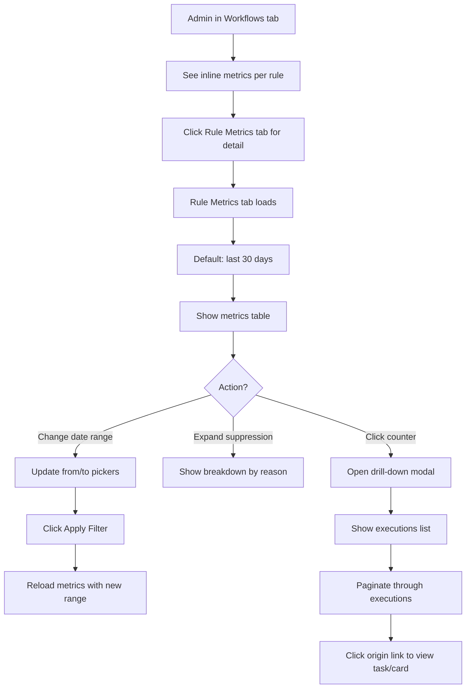

# Story 3.3: Métricas del motor de reglas v1 (validación del motor)

## Status: Ready for Dev

## Story
**As an** org admin (or project admin),
**I want** per-rule metrics and traceability with drill-down to individual executions,
**so that** I can validate the rules engine behavior, detect issues early, and understand rule effectiveness.

## Acceptance Criteria

1. **Per-rule counters**: For each rule, the system exposes counts for `evaluated`, `applied`, and `suppressed`.
2. **Suppression breakdown**: Suppressed events include reason breakdown: `idempotent | not_user_triggered | not_matching | inactive`.
3. **Date range filter**: Metrics can be filtered by start/end date range.
4. **Drill-down to executions**: Clicking on a counter shows a list of individual executions for that rule.
5. **Admin-only visibility**: Only org admins (and project admins for project-scoped rules) can access rule metrics.
6. **No leaderboards**: Rule metrics do not rank users; they focus on rule behavior.
7. **UI: Workflow summary**: Workflows/Rules view shows inline metric summary (applied/suppressed counts).
8. **UI: Dedicated metrics tab**: A dedicated "Rule Metrics" tab shows detailed metrics with filtering and drill-down.
9. **API conventions**: Responses follow `{ data: ... }` envelope; timestamps ISO-8601 UTC.

## Tasks / Subtasks

- [ ] Task 1: Server - Metrics query endpoints (AC: 1, 2, 3, 5, 9)
  - [ ] Create `apps/server/src/scrumbringer_server/http/rule_metrics.gleam`
  - [ ] Create `apps/server/src/scrumbringer_server/services/rule_metrics_db.gleam`
  - [ ] Create SQL queries in `apps/server/src/scrumbringer_server/sql/rule_metrics_*.sql`
  - [ ] Endpoints:
    - [ ] `GET /api/v1/workflows/:id/metrics` — aggregated metrics for all rules in workflow
    - [ ] `GET /api/v1/rules/:id/metrics` — aggregated metrics for single rule
    - [ ] `GET /api/v1/rules/:id/executions` — paginated list of executions (drill-down)
    - [ ] `GET /api/v1/org/rule-metrics` — org-wide metrics summary
    - [ ] `GET /api/v1/projects/:id/rule-metrics` — project-scoped metrics summary

- [ ] Task 2: Server - Date range filtering (AC: 3)
  - [ ] Add query params `from` and `to` (ISO-8601) to metrics endpoints
  - [ ] Default: last 30 days if not specified
  - [ ] Validate date range (max 90 days in v1)

- [ ] Task 3: Client - Inline metrics in Workflows view (AC: 7)
  - [ ] Modify `apps/client/src/scrumbringer_client/features/admin/workflows.gleam`
  - [ ] Show applied/suppressed counts next to each rule
  - [ ] Fetch metrics on workflow detail view load

- [ ] Task 4: Client - Dedicated Rule Metrics tab (AC: 4, 8)
  - [ ] Create `apps/client/src/scrumbringer_client/features/admin/rule_metrics.gleam`
  - [ ] Add "Rule Metrics" tab in Admin
  - [ ] Implement:
    - [ ] Date range picker (from/to)
    - [ ] Metrics table with counters per rule
    - [ ] Suppression reason breakdown (expandable)
    - [ ] Click on counter → drill-down modal/panel with executions list
  - [ ] Add i18n keys

- [ ] Task 5: Tests (AC: all)
  - [ ] Server tests: `apps/server/test/rule_metrics_test.gleam`
  - [ ] Client tests: `apps/client/test/rule_metrics_decode_test.gleam`

## Dev Notes

### Source Tree (relevante para esta story)

```
apps/
├── client/
│   ├── src/scrumbringer_client/
│   │   ├── api.gleam                          # MODIFY: add metrics endpoints
│   │   ├── features/admin/
│   │   │   ├── admin.gleam                    # MODIFY: add Rule Metrics tab
│   │   │   ├── workflows.gleam                # MODIFY: inline metrics
│   │   │   └── rule_metrics.gleam             # NEW: dedicated metrics view
│   │   └── i18n/
│   │       ├── text.gleam                     # MODIFY: add RuleMetrics* keys
│   │       ├── es.gleam                       # MODIFY
│   │       └── en.gleam                       # MODIFY
│   └── test/
│       └── rule_metrics_decode_test.gleam     # NEW
├── server/
│   ├── src/scrumbringer_server/
│   │   ├── scrumbringer_server.gleam          # MODIFY: register routes
│   │   ├── http/
│   │   │   └── rule_metrics.gleam             # NEW
│   │   ├── services/
│   │   │   └── rule_metrics_db.gleam          # NEW
│   │   └── sql/
│   │       ├── rule_metrics_by_workflow.sql   # NEW
│   │       ├── rule_metrics_by_rule.sql       # NEW
│   │       ├── rule_executions_list.sql       # NEW
│   │       └── rule_metrics_summary.sql       # NEW
│   └── test/
│       └── rule_metrics_test.gleam            # NEW
```

### Data Source (from Story 3.2)

Story 3.2 creates `rule_executions` table:

```sql
CREATE TABLE rule_executions (
    id BIGSERIAL PRIMARY KEY,
    rule_id BIGINT NOT NULL REFERENCES rules(id) ON DELETE CASCADE,
    origin_type TEXT NOT NULL,  -- 'task' | 'card'
    origin_id BIGINT NOT NULL,
    outcome TEXT NOT NULL,  -- 'applied' | 'suppressed'
    suppression_reason TEXT,  -- 'idempotent' | 'not_user_triggered' | 'not_matching' | 'inactive'
    user_id BIGINT REFERENCES users(id),
    created_at TIMESTAMPTZ NOT NULL DEFAULT NOW(),
    UNIQUE(rule_id, origin_type, origin_id)
);
```

This story queries this table for aggregated metrics.

### Metrics Queries

**Aggregated metrics per rule:**

```sql
-- rule_metrics_by_rule.sql
SELECT
    r.id AS rule_id,
    r.name AS rule_name,
    COUNT(re.id) AS evaluated_count,
    COUNT(re.id) FILTER (WHERE re.outcome = 'applied') AS applied_count,
    COUNT(re.id) FILTER (WHERE re.outcome = 'suppressed') AS suppressed_count,
    COUNT(re.id) FILTER (WHERE re.suppression_reason = 'idempotent') AS suppressed_idempotent,
    COUNT(re.id) FILTER (WHERE re.suppression_reason = 'not_user_triggered') AS suppressed_not_user,
    COUNT(re.id) FILTER (WHERE re.suppression_reason = 'not_matching') AS suppressed_not_matching,
    COUNT(re.id) FILTER (WHERE re.suppression_reason = 'inactive') AS suppressed_inactive
FROM rules r
LEFT JOIN rule_executions re ON re.rule_id = r.id
    AND re.created_at >= $2  -- from
    AND re.created_at <= $3  -- to
WHERE r.id = $1
GROUP BY r.id;
```

**Metrics for all rules in workflow:**

```sql
-- rule_metrics_by_workflow.sql
SELECT
    r.id AS rule_id,
    r.name AS rule_name,
    r.active,
    COUNT(re.id) AS evaluated_count,
    COUNT(re.id) FILTER (WHERE re.outcome = 'applied') AS applied_count,
    COUNT(re.id) FILTER (WHERE re.outcome = 'suppressed') AS suppressed_count
FROM rules r
LEFT JOIN rule_executions re ON re.rule_id = r.id
    AND re.created_at >= $2
    AND re.created_at <= $3
WHERE r.workflow_id = $1
GROUP BY r.id
ORDER BY r.name;
```

**Executions list (drill-down):**

```sql
-- rule_executions_list.sql
SELECT
    re.id,
    re.origin_type,
    re.origin_id,
    re.outcome,
    re.suppression_reason,
    re.user_id,
    u.email AS user_email,
    re.created_at
FROM rule_executions re
LEFT JOIN users u ON u.id = re.user_id
WHERE re.rule_id = $1
    AND re.created_at >= $2
    AND re.created_at <= $3
ORDER BY re.created_at DESC
LIMIT $4 OFFSET $5;
```

### API Contract

**Endpoints:**

| Method | Path | Auth | Description |
|--------|------|------|-------------|
| GET | `/api/v1/workflows/:id/metrics` | Admin | Metrics for all rules in workflow |
| GET | `/api/v1/rules/:id/metrics` | Admin | Detailed metrics for single rule |
| GET | `/api/v1/rules/:id/executions` | Admin | Paginated executions list |
| GET | `/api/v1/org/rule-metrics` | Org Admin | Org-wide summary |
| GET | `/api/v1/projects/:id/rule-metrics` | Project Admin | Project-scoped summary |

**Query params (all metrics endpoints):**

| Param | Type | Default | Description |
|-------|------|---------|-------------|
| `from` | ISO-8601 | now - 30 days | Start of date range |
| `to` | ISO-8601 | now | End of date range |

**Query params (executions list):**

| Param | Type | Default | Description |
|-------|------|---------|-------------|
| `from` | ISO-8601 | now - 30 days | Start of date range |
| `to` | ISO-8601 | now | End of date range |
| `limit` | Int | 50 | Page size (max 100) |
| `offset` | Int | 0 | Pagination offset |

**Workflow Metrics Response:**

```json
{
  "data": {
    "workflow_id": 1,
    "workflow_name": "QA Automation",
    "from": "2026-01-01T00:00:00Z",
    "to": "2026-01-18T23:59:59Z",
    "rules": [
      {
        "rule_id": 1,
        "rule_name": "Feature → QA Review",
        "active": true,
        "evaluated_count": 42,
        "applied_count": 38,
        "suppressed_count": 4
      }
    ],
    "totals": {
      "evaluated_count": 42,
      "applied_count": 38,
      "suppressed_count": 4
    }
  }
}
```

**Rule Metrics Response (detailed):**

```json
{
  "data": {
    "rule_id": 1,
    "rule_name": "Feature → QA Review",
    "from": "2026-01-01T00:00:00Z",
    "to": "2026-01-18T23:59:59Z",
    "evaluated_count": 42,
    "applied_count": 38,
    "suppressed_count": 4,
    "suppression_breakdown": {
      "idempotent": 3,
      "not_user_triggered": 1,
      "not_matching": 0,
      "inactive": 0
    }
  }
}
```

**Executions List Response:**

```json
{
  "data": {
    "rule_id": 1,
    "executions": [
      {
        "id": 123,
        "origin_type": "task",
        "origin_id": 456,
        "outcome": "applied",
        "suppression_reason": null,
        "user_id": 42,
        "user_email": "dev@team.com",
        "created_at": "2026-01-18T10:30:00Z"
      },
      {
        "id": 122,
        "origin_type": "task",
        "origin_id": 455,
        "outcome": "suppressed",
        "suppression_reason": "idempotent",
        "user_id": 42,
        "user_email": "dev@team.com",
        "created_at": "2026-01-18T10:25:00Z"
      }
    ],
    "pagination": {
      "limit": 50,
      "offset": 0,
      "total": 42
    }
  }
}
```

### Admin UI

**Inline en Workflows (resumen):**

```
┌─────────────────────────────────────────────────────────────────┐
│ Workflow: QA Automation                              [Active ✓] │
├─────────────────────────────────────────────────────────────────┤
│ Rules:                                                          │
│ ┌─────────────────────────────────────────────────────────────┐ │
│ │ Feature → QA Review          Applied: 38  Suppressed: 4    │ │
│ │ Card Done → Release          Applied: 12  Suppressed: 0    │ │
│ └─────────────────────────────────────────────────────────────┘ │
└─────────────────────────────────────────────────────────────────┘
```

**Tab dedicado "Rule Metrics":**

```
┌─────────────────────────────────────────────────────────────────┐
│ Rule Metrics                                                    │
├─────────────────────────────────────────────────────────────────┤
│ Date Range: [2026-01-01] to [2026-01-18]        [Apply Filter]  │
├─────────────────────────────────────────────────────────────────┤
│ Rule                    │ Evaluated │ Applied │ Suppressed │    │
│─────────────────────────│───────────│─────────│────────────│    │
│ Feature → QA Review     │    42     │   38    │     4  [▼] │    │
│   └─ idempotent: 3, not_user_triggered: 1                  │    │
│ Card Done → Release     │    12     │   12    │     0      │    │
└─────────────────────────────────────────────────────────────────┘
```

**Drill-down (click en counter):**

```
┌─────────────────────────────────────────────────────────────────┐
│ Executions: Feature → QA Review (Suppressed: 4)         [Close] │
├─────────────────────────────────────────────────────────────────┤
│ Time                │ Origin      │ Reason           │ User     │
│─────────────────────│─────────────│──────────────────│──────────│
│ 2026-01-18 10:30    │ Task #456   │ idempotent       │ dev@...  │
│ 2026-01-18 10:25    │ Task #455   │ idempotent       │ dev@...  │
│ 2026-01-17 15:00    │ Task #440   │ not_user_trigg.  │ (system) │
│ 2026-01-16 09:45    │ Task #430   │ idempotent       │ dev@...  │
├─────────────────────────────────────────────────────────────────┤
│ Showing 1-4 of 4                              [< Prev] [Next >] │
└─────────────────────────────────────────────────────────────────┘
```

### i18n Keys (nuevas)

```gleam
pub type Text {
  // ... existing
  RuleMetricsTab
  RuleMetricsDateRange
  RuleMetricsFrom
  RuleMetricsTo
  RuleMetricsApplyFilter
  RuleMetricsEvaluated
  RuleMetricsApplied
  RuleMetricsSuppressed
  RuleMetricsSuppressionBreakdown
  RuleMetricsReasonIdempotent
  RuleMetricsReasonNotUserTriggered
  RuleMetricsReasonNotMatching
  RuleMetricsReasonInactive
  RuleMetricsExecutions
  RuleMetricsOrigin
  RuleMetricsUser
  RuleMetricsNoData
}
```

### Security Considerations

| Concern | Mitigation |
|---------|------------|
| Authz bypass | Validate admin role per endpoint; project admins only see project-scoped |
| Data exposure | Executions show user_email only to admins of same org |
| DoS via large queries | Max date range 90 days; pagination with max limit 100 |
| CSRF | Not needed (GET endpoints are read-only) |

### Future Enhancements (out of scope for v1)

| Feature | Description |
|---------|-------------|
| Time series | Counters por día/hora para gráficos de tendencia |
| Export | CSV/JSON export de métricas |
| Alerts | Notificaciones si suppression rate > threshold |
| Goal validation | Comparar métricas con `rule.goal` |

### Testing

**Server tests (`apps/server/test/rule_metrics_test.gleam`):**

*Aggregated Metrics:*

| Test | Description | AC |
|------|-------------|-----|
| `metrics_empty_test` | Rule with no executions → all counters = 0 | AC1 |
| `metrics_applied_count_test` | N applied executions → applied_count = N | AC1 |
| `metrics_suppressed_count_test` | M suppressed executions → suppressed_count = M | AC1 |
| `metrics_evaluated_equals_sum_test` | evaluated_count = applied_count + suppressed_count | AC1 |
| `metrics_suppression_breakdown_test` | Breakdown by reason is correct | AC2 |
| `metrics_suppression_breakdown_idempotent_test` | idempotent reason counted correctly | AC2 |
| `metrics_suppression_breakdown_not_user_test` | not_user_triggered reason counted correctly | AC2 |
| `workflow_metrics_aggregates_rules_test` | Workflow metrics sums all rules | AC1 |
| `workflow_metrics_totals_test` | Workflow response includes totals object | AC1 |

*Date Filtering:*

| Test | Description | AC |
|------|-------------|-----|
| `date_filter_from_to_test` | Filter by date range works | AC3 |
| `date_filter_default_30_days_test` | No params uses last 30 days | AC3 |
| `date_filter_max_90_days_test` | Range > 90 days → truncated or error | AC3 |
| `date_filter_invalid_format_test` | Invalid date format → 422 | AC3,9 |
| `date_filter_from_after_to_test` | from > to → 422 or empty results | AC3 |

*Drill-down:*

| Test | Description | AC |
|------|-------------|-----|
| `executions_list_test` | List executions for rule | AC4 |
| `executions_list_empty_test` | Rule with no executions → empty list | AC4 |
| `executions_list_pagination_test` | Pagination with limit/offset works | AC4 |
| `executions_list_pagination_total_test` | Response includes total count | AC4 |
| `executions_list_includes_user_test` | Executions include user_id and user_email | AC4 |
| `executions_list_includes_origin_test` | Executions include origin_type and origin_id | AC4 |

*Authorization:*

| Test | Description | AC |
|------|-------------|-----|
| `authz_org_admin_sees_all_test` | Org admin can see all org metrics | AC5 |
| `authz_project_admin_sees_project_test` | Project admin sees project-scoped only | AC5 |
| `authz_member_denied_test` | Member cannot access metrics → 403 | AC5 |
| `authz_cross_org_denied_test` | Cannot access metrics from another org → 403 | AC5 |

**Client tests (`apps/client/test/rule_metrics_decode_test.gleam`):**

| Test | Description | AC |
|------|-------------|-----|
| `decode_workflow_metrics_test` | Decode workflow metrics with rules array | AC1,7 |
| `decode_workflow_metrics_totals_test` | Decode totals object correctly | AC1 |
| `decode_rule_metrics_test` | Decode rule metrics with breakdown | AC2 |
| `decode_rule_metrics_breakdown_test` | Decode suppression_breakdown object | AC2 |
| `decode_executions_list_test` | Decode executions with all fields | AC4 |
| `decode_executions_pagination_test` | Decode pagination object | AC4 |

**Commands:**
- Server: `make test`
- Client: `cd apps/client && gleam test`

## Frontend Spec

### Overview

La UI de métricas tiene dos partes:
1. **Inline en Workflows** - Contadores de applied/suppressed por regla
2. **Tab dedicado "Rule Metrics"** - Vista completa con filtros y drill-down

### User Flow: Viewing Rule Metrics



### Key Screens

#### Inline Metrics in Workflows Tab (from Story 3.2)

```
┌─────────────────────────────────────────────────────────────────┐
│ ▼ QA Automation                              Org    [✓ Active]  │
├─────────────────────────────────────────────────────────────────┤
│ RULES                                                           │
│ ┌─────────────────────────────────────────────────────────────┐ │
│ │ Feature → QA Review           [✓]                 [✎] [🗑] │ │
│ │ Task(Feature) → completed                                   │ │
│ │ 📊 Applied: 38  Suppressed: 4                   [View ▶]   │ │
│ └─────────────────────────────────────────────────────────────┘ │
│ ┌─────────────────────────────────────────────────────────────┐ │
│ │ Card Done → Release           [✓]                 [✎] [🗑] │ │
│ │ Card → cerrada                                              │ │
│ │ 📊 Applied: 12  Suppressed: 0                   [View ▶]   │ │
│ └─────────────────────────────────────────────────────────────┘ │
└─────────────────────────────────────────────────────────────────┘
```

#### Dedicated Rule Metrics Tab

```
┌─────────────────────────────────────────────────────────────────┐
│ ADMIN > Rule Metrics                                            │
├─────────────────────────────────────────────────────────────────┤
│                                                                 │
│ Date Range                                                      │
│ ┌──────────────┐    ┌──────────────┐                           │
│ │ 📅 2026-01-01│ to │ 📅 2026-01-18│    [Apply Filter]         │
│ └──────────────┘    └──────────────┘                           │
│                                                                 │
│ Workflow: [▼ All workflows        ]                            │
│                                                                 │
├─────────────────────────────────────────────────────────────────┤
│                                                                 │
│ ┌─────────────────────────────────────────────────────────────┐ │
│ │ Rule                    │Evaluated│ Applied │Suppressed│    │ │
│ ├─────────────────────────┼─────────┼─────────┼──────────┼────┤ │
│ │ Feature → QA Review     │   42    │  [38]   │   [4]    │ ▼  │ │
│ │ ├─ Suppression breakdown:                              │    │ │
│ │ │  • idempotent: 3                                     │    │ │
│ │ │  • not_user_triggered: 1                             │    │ │
│ ├─────────────────────────┼─────────┼─────────┼──────────┼────┤ │
│ │ Card Done → Release     │   12    │  [12]   │   [0]    │ ▶  │ │
│ ├─────────────────────────┼─────────┼─────────┼──────────┼────┤ │
│ │ Bug → Regression Test   │   25    │  [20]   │   [5]    │ ▶  │ │
│ └─────────────────────────────────────────────────────────────┘ │
│                                                                 │
│ ─────────────────────────────────────────────────────────────── │
│ TOTALS                    │   79    │   70    │    9     │      │
│                                                                 │
└─────────────────────────────────────────────────────────────────┘

[38] [4] = clickable counters for drill-down
▼ ▶ = expand/collapse suppression breakdown
```

#### Drill-down Modal: Executions List

```
┌─────────────────────────────────────────────────────────────────┐
│ Rule Executions: Feature → QA Review                     [✕]    │
├─────────────────────────────────────────────────────────────────┤
│                                                                 │
│ Showing: Suppressed executions (4 total)                       │
│                                                                 │
│ ┌─────────────────────────────────────────────────────────────┐ │
│ │ Time             │ Origin       │ Reason          │ User    │ │
│ ├──────────────────┼──────────────┼─────────────────┼─────────┤ │
│ │ Jan 18, 10:30    │ [Task #456]  │ 🔁 idempotent   │ @john   │ │
│ │ Jan 18, 10:25    │ [Task #455]  │ 🔁 idempotent   │ @john   │ │
│ │ Jan 17, 15:00    │ [Task #440]  │ 🤖 not_user_tr. │ (system)│ │
│ │ Jan 16, 09:45    │ [Task #430]  │ 🔁 idempotent   │ @jane   │ │
│ └─────────────────────────────────────────────────────────────┘ │
│                                                                 │
│ Showing 1-4 of 4                        [◀ Prev]  [Next ▶]     │
│                                                                 │
└─────────────────────────────────────────────────────────────────┘
```

#### Drill-down: Applied Executions

```
┌─────────────────────────────────────────────────────────────────┐
│ Rule Executions: Feature → QA Review                     [✕]    │
├─────────────────────────────────────────────────────────────────┤
│                                                                 │
│ Showing: Applied executions (38 total)                         │
│                                                                 │
│ ┌─────────────────────────────────────────────────────────────┐ │
│ │ Time             │ Origin       │ Tasks Created   │ User    │ │
│ ├──────────────────┼──────────────┼─────────────────┼─────────┤ │
│ │ Jan 18, 11:00    │ [Task #460]  │ 1 task created  │ @john   │ │
│ │ Jan 18, 09:15    │ [Task #458]  │ 1 task created  │ @jane   │ │
│ │ Jan 17, 16:30    │ [Task #445]  │ 1 task created  │ @john   │ │
│ │ ...              │ ...          │ ...             │ ...     │ │
│ └─────────────────────────────────────────────────────────────┘ │
│                                                                 │
│ Showing 1-50 of 38                      [◀ Prev]  [Next ▶]     │
│                                                                 │
└─────────────────────────────────────────────────────────────────┘
```

#### Empty State

```
┌─────────────────────────────────────────────────────────────────┐
│ ADMIN > Rule Metrics                                            │
├─────────────────────────────────────────────────────────────────┤
│                                                                 │
│ Date Range: [2026-01-01] to [2026-01-18]      [Apply Filter]   │
│                                                                 │
├─────────────────────────────────────────────────────────────────┤
│                                                                 │
│                    📊                                           │
│                                                                 │
│            No metrics data for this period                      │
│                                                                 │
│   Rules haven't been evaluated yet, or no workflows exist.     │
│   Create workflows and rules to start tracking metrics.         │
│                                                                 │
│                    [Go to Workflows →]                          │
│                                                                 │
└─────────────────────────────────────────────────────────────────┘
```

### Components

| Component | File | Status | Description |
|-----------|------|--------|-------------|
| `RuleMetricsTab` | `features/admin/rule_metrics.gleam` | NEW | Main metrics view |
| `DateRangePicker` | `ui/date_picker.gleam` | NEW | From/To date inputs |
| `MetricsTable` | `features/admin/rule_metrics.gleam` | NEW | Table with counters |
| `MetricsRow` | `features/admin/rule_metrics.gleam` | NEW | Row with expandable breakdown |
| `SuppressionBreakdown` | `features/admin/rule_metrics.gleam` | NEW | Reason breakdown list |
| `ExecutionsModal` | `features/admin/rule_metrics.gleam` | NEW | Drill-down modal |
| `ExecutionsList` | `features/admin/rule_metrics.gleam` | NEW | Paginated executions |
| `Pagination` | `ui/pagination.gleam` | NEW | Reusable pagination |
| `RuleInlineMetrics` | `features/admin/workflows.gleam` | MODIFY | Add inline counters |

### Component State

```gleam
type RuleMetricsState {
  date_from: Date
  date_to: Date
  workflow_filter: Option(Int)  // None = all workflows
  metrics: Remote(WorkflowMetrics)
  expanded_rules: Set(Int)  // rule_ids with visible breakdown
  drill_down: Option(DrillDownState)
}

type WorkflowMetrics {
  workflow_id: Option(Int)
  workflow_name: Option(String)
  from: Time
  to: Time
  rules: List(RuleMetrics)
  totals: MetricsTotals
}

type RuleMetrics {
  rule_id: Int
  rule_name: String
  active: Bool
  evaluated_count: Int
  applied_count: Int
  suppressed_count: Int
  suppression_breakdown: SuppressionBreakdown
}

type SuppressionBreakdown {
  idempotent: Int
  not_user_triggered: Int
  not_matching: Int
  inactive: Int
}

type MetricsTotals {
  evaluated_count: Int
  applied_count: Int
  suppressed_count: Int
}

type DrillDownState {
  rule_id: Int
  rule_name: String
  outcome_filter: OutcomeFilter  // Applied | Suppressed | All
  executions: Remote(ExecutionsList)
  page: Int
}

type ExecutionsList {
  executions: List(Execution)
  pagination: Pagination
}

type Execution {
  id: Int
  origin_type: String  // "task" | "card"
  origin_id: Int
  outcome: String
  suppression_reason: Option(String)
  user_id: Option(Int)
  user_email: Option(String)
  created_at: Time
}

type Pagination {
  limit: Int
  offset: Int
  total: Int
}
```

### States & Interactions

| State | Visual | Behavior |
|-------|--------|----------|
| **Loading** | Spinner | Fetch metrics for date range |
| **Empty** | Empty state with hint | Link to Workflows tab |
| **With data** | Metrics table | Counters clickable |
| **Date change** | Date pickers | Requires Apply button |
| **Filter workflow** | Dropdown | Filter to single workflow |
| **Expand breakdown** | ▼ arrow | Show suppression reasons |
| **Drill-down** | Modal | Show executions list |
| **Pagination** | Prev/Next | Load more executions |

### Date Range Validation

| Scenario | Behavior |
|----------|----------|
| Default | Last 30 days |
| Max range | 90 days (show warning if exceeded) |
| from > to | Show error, disable Apply |
| Invalid date | Show error on field |

### Suppression Reason Icons

| Reason | Icon | Description |
|--------|------|-------------|
| `idempotent` | 🔁 | Rule already fired for this origin |
| `not_user_triggered` | 🤖 | System change, not user action |
| `not_matching` | 🚫 | Filter conditions not met |
| `inactive` | ⏸ | Rule or workflow was inactive |

### Responsive Behavior

| Breakpoint | Metrics Table | Drill-down |
|------------|---------------|------------|
| Desktop (>1024px) | Full table | Modal 720px |
| Tablet (640-1024px) | Hide Evaluated column | Modal 90% |
| Mobile (<640px) | Stacked cards | Full screen |

### Accessibility

| Requirement | Implementation |
|-------------|----------------|
| Clickable counters | `role="button"`, `tabindex="0"` |
| Date pickers | Native `<input type="date">` |
| Expandable rows | `aria-expanded`, `aria-controls` |
| Pagination | `aria-label` on buttons, current page announced |
| Modal | Focus trap, Escape to close |
| Origin links | Clear link text "[Task #456]" |

### CSS Classes

```css
/* Metrics table */
.metrics-table {
  width: 100%;
  border-collapse: collapse;
}

.metrics-table th {
  text-align: left;
  padding: 12px;
  font-weight: 600;
  color: var(--sb-text-muted);
  border-bottom: 2px solid var(--sb-border);
}

.metrics-table td {
  padding: 12px;
  border-bottom: 1px solid var(--sb-border);
}

.metrics-table tr:hover {
  background: var(--sb-surface-hover);
}

/* Clickable counter */
.metric-counter {
  display: inline-flex;
  align-items: center;
  justify-content: center;
  min-width: 48px;
  padding: 4px 12px;
  border-radius: 4px;
  font-weight: 600;
  cursor: pointer;
  transition: background 0.2s;
}

.metric-counter:hover {
  background: var(--sb-surface-hover);
}

.metric-counter.applied {
  color: var(--sb-success);
}

.metric-counter.suppressed {
  color: var(--sb-warning);
}

.metric-counter.zero {
  color: var(--sb-text-muted);
  cursor: default;
}

/* Suppression breakdown */
.suppression-breakdown {
  padding: 8px 12px 8px 24px;
  font-size: 0.9em;
  color: var(--sb-text-muted);
  background: var(--sb-surface-elevated);
  border-left: 3px solid var(--sb-warning);
}

.suppression-item {
  display: flex;
  align-items: center;
  gap: 8px;
  padding: 4px 0;
}

.suppression-icon {
  font-size: 1em;
}

/* Expand toggle */
.expand-toggle {
  width: 24px;
  height: 24px;
  display: flex;
  align-items: center;
  justify-content: center;
  cursor: pointer;
  transition: transform 0.2s;
}

.expand-toggle.expanded {
  transform: rotate(90deg);
}

/* Date range */
.date-range-picker {
  display: flex;
  align-items: center;
  gap: 12px;
  margin-bottom: 16px;
}

.date-input {
  padding: 8px 12px;
  border: 1px solid var(--sb-border);
  border-radius: 6px;
  background: var(--sb-surface);
}

/* Totals row */
.metrics-totals {
  font-weight: 700;
  background: var(--sb-surface-elevated);
}

/* Executions list */
.executions-table {
  width: 100%;
  border-collapse: collapse;
  font-size: 0.9em;
}

.executions-table th {
  text-align: left;
  padding: 10px;
  background: var(--sb-surface-elevated);
}

.executions-table td {
  padding: 10px;
  border-bottom: 1px solid var(--sb-border);
}

.origin-link {
  color: var(--sb-primary);
  text-decoration: none;
}

.origin-link:hover {
  text-decoration: underline;
}

/* Empty state */
.metrics-empty {
  text-align: center;
  padding: 48px 24px;
  color: var(--sb-text-muted);
}

.metrics-empty-icon {
  font-size: 3em;
  margin-bottom: 16px;
}

/* Pagination */
.pagination {
  display: flex;
  align-items: center;
  justify-content: space-between;
  padding: 12px 0;
  font-size: 0.9em;
  color: var(--sb-text-muted);
}

.pagination-buttons {
  display: flex;
  gap: 8px;
}
```

### i18n Keys

| Key | ES | EN |
|-----|----|----|
| `RuleMetricsTab` | Métricas de reglas | Rule Metrics |
| `RuleMetricsDateRange` | Rango de fechas | Date Range |
| `RuleMetricsFrom` | Desde | From |
| `RuleMetricsTo` | Hasta | To |
| `RuleMetricsApplyFilter` | Aplicar filtro | Apply Filter |
| `RuleMetricsWorkflow` | Workflow | Workflow |
| `RuleMetricsAllWorkflows` | Todos los workflows | All workflows |
| `RuleMetricsEvaluated` | Evaluadas | Evaluated |
| `RuleMetricsApplied` | Aplicadas | Applied |
| `RuleMetricsSuppressed` | Suprimidas | Suppressed |
| `RuleMetricsTotals` | Totales | Totals |
| `RuleMetricsSuppressionBreakdown` | Desglose de supresiones | Suppression breakdown |
| `RuleMetricsReasonIdempotent` | Idempotencia (ya ejecutada) | Idempotent (already fired) |
| `RuleMetricsReasonNotUserTriggered` | No disparada por usuario | Not user triggered |
| `RuleMetricsReasonNotMatching` | No coincide filtro | Filter not matching |
| `RuleMetricsReasonInactive` | Regla/workflow inactivo | Rule/workflow inactive |
| `RuleMetricsExecutions` | Ejecuciones | Executions |
| `RuleMetricsOrigin` | Origen | Origin |
| `RuleMetricsUser` | Usuario | User |
| `RuleMetricsTime` | Fecha/hora | Time |
| `RuleMetricsTasksCreated` | Tareas creadas | Tasks created |
| `RuleMetricsNoData` | Sin datos para este período | No data for this period |
| `RuleMetricsNoDataHint` | Las reglas no han sido evaluadas aún | Rules haven't been evaluated yet |
| `RuleMetricsGoToWorkflows` | Ir a Workflows | Go to Workflows |
| `RuleMetricsShowing` | Mostrando | Showing |
| `RuleMetricsOf` | de | of |
| `RuleMetricsPrev` | Anterior | Prev |
| `RuleMetricsNext` | Siguiente | Next |
| `RuleMetricsDateRangeMax` | Rango máximo: 90 días | Maximum range: 90 days |
| `RuleMetricsDateRangeInvalid` | Fecha inicial posterior a final | Start date after end date |

## Change Log
| Date | Version | Description | Author |
|------|---------|-------------|--------|
| 2026-01-14 | 0.1 | Planning stub created | po |
| 2026-01-18 | 0.2 | Full story: date filter, drill-down, inline + dedicated UI | po |
| 2026-01-18 | 0.3 | Added Frontend Spec: metrics tab, date picker, drill-down modal, pagination | ux |

## Dev Agent Record

### Agent Model Used

### Debug Log References

### Completion Notes List

### File List

## QA Results
