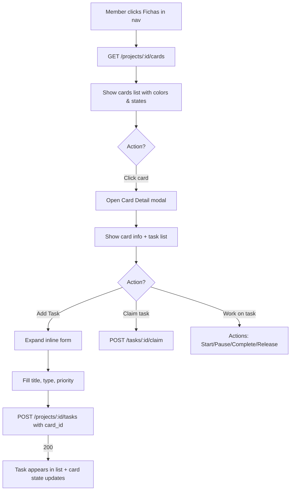
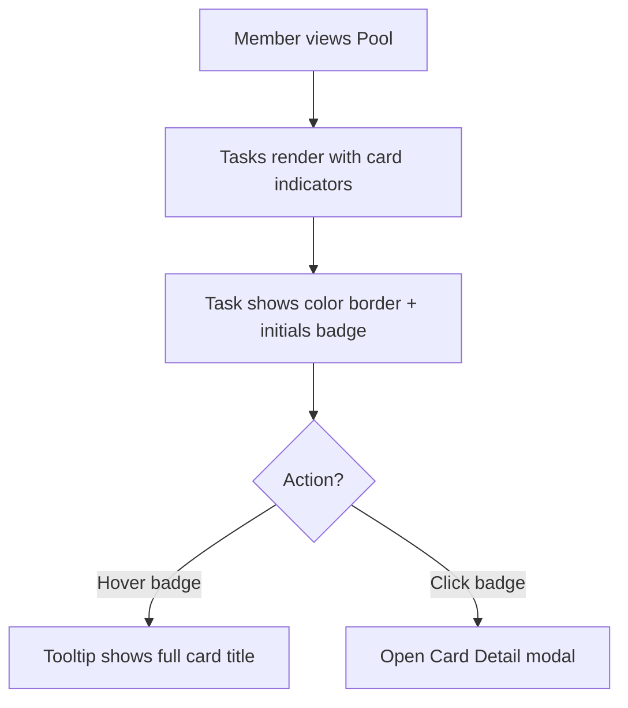
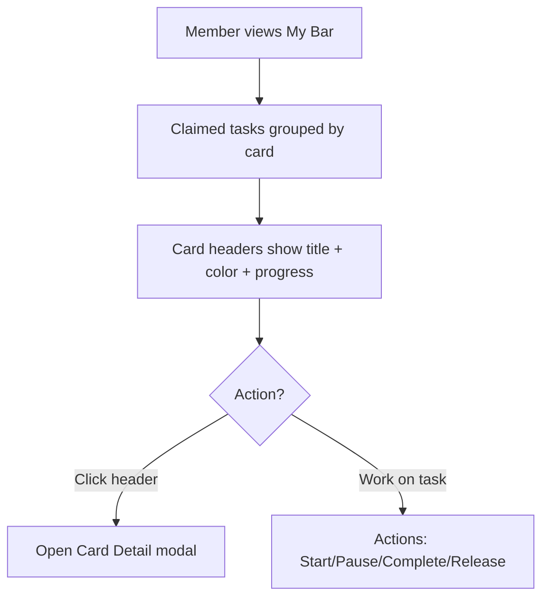

# Story 3.4: Member Card Views (UX para fichas en vistas de miembro)

## Status: Done

## Story
**As a** team member,
**I want** to see, interact with, and create tasks from Cards in my member views,
**so that** I can understand task groupings, track Card progress, and efficiently organize my work.

## Acceptance Criteria

1. **Member nav**: A new "Fichas" (Cards) section appears in the member navigation, showing the user's project cards with state badges.
2. **Color selector**: Cards have an optional color field. The color selector is a dropdown showing the color icon (swatch) and name.
3. **Create task from Card**: From the Card detail view, members can create new tasks that automatically belong to that Card.
4. **Pool identification**: Tasks in the Pool display their parent Card via a color border (left edge) and an initials badge (2 letters from Card title).
5. **My bar grouping**: In "Mi barra" section, claimed tasks are visually grouped by their parent Card (tasks without Card appear ungrouped).
6. **Mobile adaptations**: All Card UX works on mobile with appropriate touch targets and responsive layouts.
7. **Color palette**: System provides 8 predefined colors with CSS variables for consistent theming.

## Tasks / Subtasks

- [ ] Task 1: DB schema - Add color field to cards (AC: 2, 7)
  - [ ] Create migration `db/migrations/20260120XXXXXX_add_card_color.sql`
    - [ ] Add `color` column (nullable TEXT, one of: null, "gray", "red", "orange", "yellow", "green", "blue", "purple", "pink")
  - [ ] Run `make squirrel` to generate types

- [ ] Task 2: Server - Card color endpoints (AC: 2)
  - [ ] Modify `apps/server/src/scrumbringer_server/http/cards.gleam`
    - [ ] Accept `color` in POST/PATCH body
    - [ ] Include `color` in card responses
  - [ ] Validate color is one of allowed values

- [ ] Task 3: Client - Color selector component (AC: 2, 7)
  - [ ] Create `apps/client/src/scrumbringer_client/ui/color_picker.gleam`
  - [ ] Dropdown with 8 colors + "None" option
  - [ ] Each option shows: color swatch icon + color name
  - [ ] Define CSS variables: `--sb-card-gray`, `--sb-card-red`, etc.

- [ ] Task 4: Client - Member nav Fichas section (AC: 1)
  - [ ] Modify `apps/client/src/scrumbringer_client/client_view.gleam`
    - [ ] Add "Fichas" nav item in member section
  - [ ] Create `apps/client/src/scrumbringer_client/features/fichas/view.gleam`
    - [ ] List cards for current project with state badges
    - [ ] Click card opens detail modal

- [ ] Task 5: Client - Card detail with create task (AC: 3)
  - [ ] Modify/create `apps/client/src/scrumbringer_client/features/fichas/card_detail.gleam`
    - [ ] Card info header (title, description, state, color badge)
    - [ ] Task list with status indicators
    - [ ] "Add Task" inline form (title, type, priority)
    - [ ] Created task gets `card_id` automatically

- [ ] Task 6: Client - Pool task Card identification (AC: 4)
  - [ ] Modify `apps/client/src/scrumbringer_client/features/pool/view.gleam`
    - [ ] Add color border (left edge) for tasks with cards
    - [ ] Add initials badge (2 letters) with card color background
  - [ ] Modify `apps/client/src/scrumbringer_client/features/pool/task_card.gleam` (if exists) or inline
  - [ ] Add CSS: `.task-card-border-{color}`, `.task-initials-badge`

- [ ] Task 7: Client - My bar Card grouping (AC: 5)
  - [ ] Modify `apps/client/src/scrumbringer_client/features/my_bar/view.gleam`
    - [ ] Group claimed tasks by card_id
    - [ ] Show card header for each group (title + color + progress)
    - [ ] Ungrouped tasks appear in separate section

- [ ] Task 8: Client - Mobile adaptations (AC: 6)
  - [ ] Responsive Fichas list (card layout on mobile)
  - [ ] Responsive Card detail (full-screen modal on mobile)
  - [ ] Touch-friendly color picker dropdown
  - [ ] Appropriate touch targets (min 44px)

- [ ] Task 9: i18n keys (AC: all)
  - [ ] Modify `apps/client/src/scrumbringer_client/i18n/text.gleam`
  - [ ] Modify `apps/client/src/scrumbringer_client/i18n/es.gleam`
  - [ ] Modify `apps/client/src/scrumbringer_client/i18n/en.gleam`

- [ ] Task 10: Tests (AC: all)
  - [ ] Client tests: `apps/client/test/fichas_view_test.gleam`
  - [ ] Server tests: Update `apps/server/test/cards_test.gleam` for color field

## Dev Notes

### Source Tree (relevante para esta story)

```
apps/
├── client/
│   ├── src/scrumbringer_client/
│   │   ├── client_view.gleam              # MODIFY: add Fichas nav item
│   │   ├── features/
│   │   │   ├── fichas/                    # NEW: Member Fichas feature
│   │   │   │   ├── view.gleam             # NEW: Fichas list view
│   │   │   │   └── card_detail.gleam      # NEW: Card detail modal
│   │   │   ├── pool/
│   │   │   │   └── view.gleam             # MODIFY: add card identification
│   │   │   └── my_bar/
│   │   │       └── view.gleam             # MODIFY: add card grouping
│   │   ├── ui/
│   │   │   └── color_picker.gleam         # NEW: Color selector component
│   │   ├── styles.gleam                   # MODIFY: add card color CSS
│   │   └── i18n/
│   │       ├── text.gleam                 # MODIFY: add Fichas* keys
│   │       ├── es.gleam                   # MODIFY
│   │       └── en.gleam                   # MODIFY
│   └── test/
│       └── fichas_view_test.gleam         # NEW
├── server/
│   ├── src/scrumbringer_server/
│   │   ├── http/
│   │   │   └── cards.gleam                # MODIFY: add color field
│   │   └── sql/
│   │       ├── cards_create.sql           # MODIFY: add color
│   │       └── cards_update.sql           # MODIFY: add color
│   └── test/
│       └── cards_test.gleam               # MODIFY: add color tests
└── db/
    └── migrations/
        └── 20260120XXXXXX_add_card_color.sql  # NEW
```

### Color Palette

**Predefined colors (8):**

| Name | CSS Variable | Hex | Use Case |
|------|--------------|-----|----------|
| Gray | `--sb-card-gray` | `#6B7280` | Default/neutral |
| Red | `--sb-card-red` | `#EF4444` | Urgent/blocked |
| Orange | `--sb-card-orange` | `#F97316` | High priority |
| Yellow | `--sb-card-yellow` | `#EAB308` | In review |
| Green | `--sb-card-green` | `#22C55E` | On track |
| Blue | `--sb-card-blue` | `#3B82F6` | Feature work |
| Purple | `--sb-card-purple` | `#8B5CF6` | Technical debt |
| Pink | `--sb-card-pink` | `#EC4899` | Design/UX |

**Storage:** Color stored as string enum in DB: `"gray" | "red" | "orange" | "yellow" | "green" | "blue" | "purple" | "pink" | null`

### Color Selector Component

**Dropdown structure:**

```
┌────────────────────────────────┐
│ [●] Ninguno                    │ ← Default option (no color)
├────────────────────────────────┤
│ [●] Gris                       │
│ [●] Rojo                       │
│ [●] Naranja                    │
│ [●] Amarillo                   │
│ [●] Verde                      │
│ [●] Azul                       │
│ [●] Morado                     │
│ [●] Rosa                       │
└────────────────────────────────┘

[●] = color swatch (circular, 16px, filled with the color)
```

### Initials Badge

**Rules for generating initials:**
1. Take first 2 characters of first 2 words (e.g., "OAuth Implementation" → "OI")
2. If single word, take first 2 characters (e.g., "Refactor" → "RE")
3. Uppercase always
4. Max 2 characters

**Badge styling:**
- Background: Card color (or `--sb-muted` if no color)
- Text: White
- Size: 24px × 24px (desktop), 20px × 20px (mobile)
- Border-radius: 4px
- Font: 10px, bold

### Task Card Identification in Pool

```
┌──────────────────────────┐
│▌ [▶] [✓] [↩]             │  ← 4px left border in card color
│▌     🔧                  │
│▌  Fix login validation   │
│▌     ──────              │
│▌  [OI] P3 • 2d ago       │  ← [OI] = initials badge
└──────────────────────────┘
```

**Hover behavior:** On hover, show tooltip with full card title.

### My Bar Grouping

```
┌─────────────────────────────────────────────────────────────────┐
│ MI BARRA                                                        │
├─────────────────────────────────────────────────────────────────┤
│                                                                 │
│ ┌─────────────────────────────────────────────────────────────┐ │
│ │▌ OAUTH IMPLEMENTATION              [🟡 en_curso]  1/3       │ │ ← Card header
│ │▌                                                            │ │
│ │▌ ┌───────────────────────────────────────────────────────┐ │ │
│ │▌ │ [▶] Fix login validation                 ⏱ 01:23:45   │ │ │
│ │▌ └───────────────────────────────────────────────────────┘ │ │
│ │▌ ┌───────────────────────────────────────────────────────┐ │ │
│ │▌ │ [▶] Add token refresh                    ⏱ 00:15:00   │ │ │
│ │▌ └───────────────────────────────────────────────────────┘ │ │
│ └─────────────────────────────────────────────────────────────┘ │
│                                                                 │
│ ┌─────────────────────────────────────────────────────────────┐ │
│ │ SETUP CI/CD                        [🟢 cerrada]   5/5       │ │
│ │                                                             │ │
│ │ ┌───────────────────────────────────────────────────────┐  │ │
│ │ │ [▶] Configure GitHub Actions          ⏱ 00:45:00      │  │ │
│ │ └───────────────────────────────────────────────────────┘  │ │
│ └─────────────────────────────────────────────────────────────┘ │
│                                                                 │
│ ┌─────────────────────────────────────────────────────────────┐ │
│ │ SIN FICHA                                                   │ │ ← Ungrouped
│ │                                                             │ │
│ │ ┌───────────────────────────────────────────────────────┐  │ │
│ │ │ [▶] Update README                     ⏱ 00:05:00      │  │ │
│ │ └───────────────────────────────────────────────────────┘  │ │
│ └─────────────────────────────────────────────────────────────┘ │
│                                                                 │
└─────────────────────────────────────────────────────────────────┘
```

### API Contract Updates

**Card resource (updated):**

```json
{
  "id": 1,
  "project_id": 10,
  "title": "Implementar OAuth",
  "description": "Login con Google y GitHub",
  "color": "blue",
  "state": "en_curso",
  "task_count": 3,
  "completed_count": 1,
  "created_by": 42,
  "created_at": "2026-01-18T10:00:00Z"
}
```

**Task resource (updated):**

```json
{
  "id": 100,
  "title": "Fix login validation",
  "card_id": 1,
  "card_title": "Implementar OAuth",
  "card_color": "blue",
  ...
}
```

**Create/Update card request (updated):**

```json
POST /api/v1/projects/10/cards
{
  "title": "Implementar OAuth",
  "description": "Login con Google y GitHub",
  "color": "blue"
}
```

### Member Fichas View

```
┌─────────────────────────────────────────────────────────────────┐
│ FICHAS                                                          │
├─────────────────────────────────────────────────────────────────┤
│                                                                 │
│ ┌─────────────────────────────────────────────────────────────┐ │
│ │▌ Implementar OAuth              [🟡 en_curso]  1/3          │ │
│ │▌ Login con Google y GitHub                                  │ │
│ └─────────────────────────────────────────────────────────────┘ │
│                                                                 │
│ ┌─────────────────────────────────────────────────────────────┐ │
│ │▌ Setup CI/CD                    [🟢 cerrada]   5/5          │ │
│ │▌ Configurar pipeline de deploy                              │ │
│ └─────────────────────────────────────────────────────────────┘ │
│                                                                 │
│ ┌─────────────────────────────────────────────────────────────┐ │
│ │  Refactor auth                  [🔵 pendiente] 0/0          │ │
│ │  Limpiar código de autenticación                            │ │
│ └─────────────────────────────────────────────────────────────┘ │
│                                                                 │
└─────────────────────────────────────────────────────────────────┘

▌ = left border in card color (or none if no color)
```

### Card Detail Modal (Member)

```
┌─────────────────────────────────────────────────────────────────┐
│▌ IMPLEMENTAR OAUTH                                       [✕]   │
│▌ ───────────────────────────────────────────────────────────── │
│▌ 🟡 en_curso  •  1/3 completadas  •  ████████░░░░ 33%         │
│▌                                                               │
│▌ Login con Google y GitHub providers.                          │
│▌ Includes token refresh and session management.                │
├─────────────────────────────────────────────────────────────────┤
│ TAREAS                                          [+ Añadir]      │
├─────────────────────────────────────────────────────────────────┤
│                                                                 │
│ ┌ ─ ─ ─ ─ ─ ─ ─ ─ ─ ─ ─ ─ ─ ─ ─ ─ ─ ─ ─ ─ ─ ─ ─ ─ ─ ─ ─ ─ ┐  │
│   + NUEVA TAREA                                              │  │
│ │ Título: [                                                ] │  │
│   Tipo:   [▼ Feature    ]  Prioridad: [●●●○○]                   │
│ │                              [Cancelar]  [Crear]           │  │
│ └ ─ ─ ─ ─ ─ ─ ─ ─ ─ ─ ─ ─ ─ ─ ─ ─ ─ ─ ─ ─ ─ ─ ─ ─ ─ ─ ─ ─ ┘  │
│                                                                 │
│ ┌───────────────────────────────────────────────────────────┐  │
│ │ ✅ Configure OAuth provider              @jane.smith       │  │
│ └───────────────────────────────────────────────────────────┘  │
│                                                                 │
│ ┌───────────────────────────────────────────────────────────┐  │
│ │ 🟡 Fix login validation   [⏸][✓][↩]      ⏱ 01:23:45       │  │
│ └───────────────────────────────────────────────────────────┘  │
│                                                                 │
│ ┌───────────────────────────────────────────────────────────┐  │
│ │ ⚪ Add session refresh                         [Reclamar]  │  │
│ └───────────────────────────────────────────────────────────┘  │
│                                                                 │
└─────────────────────────────────────────────────────────────────┘

▌ = left border in card color
```

### CSS Classes

```css
/* Card colors */
:root {
  --sb-card-gray: #6B7280;
  --sb-card-red: #EF4444;
  --sb-card-orange: #F97316;
  --sb-card-yellow: #EAB308;
  --sb-card-green: #22C55E;
  --sb-card-blue: #3B82F6;
  --sb-card-purple: #8B5CF6;
  --sb-card-pink: #EC4899;
}

/* Card border (left edge) */
.card-border-gray { border-left: 4px solid var(--sb-card-gray); }
.card-border-red { border-left: 4px solid var(--sb-card-red); }
.card-border-orange { border-left: 4px solid var(--sb-card-orange); }
.card-border-yellow { border-left: 4px solid var(--sb-card-yellow); }
.card-border-green { border-left: 4px solid var(--sb-card-green); }
.card-border-blue { border-left: 4px solid var(--sb-card-blue); }
.card-border-purple { border-left: 4px solid var(--sb-card-purple); }
.card-border-pink { border-left: 4px solid var(--sb-card-pink); }

/* Initials badge */
.card-initials-badge {
  display: inline-flex;
  align-items: center;
  justify-content: center;
  width: 24px;
  height: 24px;
  border-radius: 4px;
  font-size: 10px;
  font-weight: 700;
  color: white;
  text-transform: uppercase;
}

.card-initials-gray { background: var(--sb-card-gray); }
.card-initials-red { background: var(--sb-card-red); }
.card-initials-orange { background: var(--sb-card-orange); }
.card-initials-yellow { background: var(--sb-card-yellow); }
.card-initials-green { background: var(--sb-card-green); }
.card-initials-blue { background: var(--sb-card-blue); }
.card-initials-purple { background: var(--sb-card-purple); }
.card-initials-pink { background: var(--sb-card-pink); }
.card-initials-none { background: var(--sb-muted); }

/* Color picker dropdown */
.color-picker-dropdown {
  display: flex;
  flex-direction: column;
  gap: 4px;
  padding: 8px;
  background: var(--sb-surface);
  border: 1px solid var(--sb-border);
  border-radius: 8px;
  box-shadow: var(--sb-shadow-md);
}

.color-picker-option {
  display: flex;
  align-items: center;
  gap: 8px;
  padding: 8px 12px;
  border-radius: 4px;
  cursor: pointer;
}

.color-picker-option:hover {
  background: var(--sb-surface-hover);
}

.color-picker-option.selected {
  background: color-mix(in srgb, var(--sb-primary) 15%, transparent);
}

.color-picker-swatch {
  width: 16px;
  height: 16px;
  border-radius: 50%;
  border: 2px solid transparent;
}

.color-picker-swatch.selected {
  border-color: var(--sb-primary);
}

/* Card group header in My Bar */
.my-bar-card-group {
  margin-bottom: 16px;
}

.my-bar-card-header {
  display: flex;
  align-items: center;
  gap: 12px;
  padding: 8px 12px;
  background: var(--sb-surface-elevated);
  border-radius: 8px 8px 0 0;
  font-weight: 600;
}

.my-bar-card-tasks {
  display: flex;
  flex-direction: column;
  gap: 8px;
  padding: 12px;
  background: var(--sb-surface);
  border-radius: 0 0 8px 8px;
  border-left: 4px solid var(--sb-card-blue); /* card color */
}

/* Responsive */
@media (max-width: 640px) {
  .card-initials-badge {
    width: 20px;
    height: 20px;
    font-size: 9px;
  }
}
```

### i18n Keys (nuevas)

```gleam
pub type Text {
  // ... existing

  // Member Fichas section
  MemberFichas
  MemberFichasEmpty
  MemberFichasEmptyHint

  // Color picker
  ColorLabel
  ColorNone
  ColorGray
  ColorRed
  ColorOrange
  ColorYellow
  ColorGreen
  ColorBlue
  ColorPurple
  ColorPink

  // Card grouping
  UngroupedTasks
  CardProgressCount(completed: Int, total: Int)

  // Card detail (member)
  CardTasks
  CardAddTask
  CardTasksEmpty
}
```

### Security Considerations

| Concern | Mitigation |
|---------|------------|
| Color injection | Validate color is from allowed enum on server |
| Authz for task creation | Verify user is project member before creating task |
| XSS in card title | Card titles are text-only, HTML escaped in render |

### Testing

**Server tests (update `apps/server/test/cards_test.gleam`):**

| Test | Description | AC |
|------|-------------|-----|
| `create_card_with_color_test` | Create card with valid color → 200 | AC2 |
| `create_card_with_invalid_color_test` | Invalid color value → 422 | AC2 |
| `update_card_color_test` | PATCH color → 200 | AC2 |
| `list_cards_includes_color_test` | List returns color field | AC2 |

**Client tests (`apps/client/test/fichas_view_test.gleam`):**

| Test | Description | AC |
|------|-------------|-----|
| `render_fichas_list_test` | Member sees cards with state badges | AC1 |
| `color_picker_options_test` | All 8 colors + none option render | AC2,7 |
| `task_card_shows_initials_test` | Pool task shows card initials badge | AC4 |
| `my_bar_groups_by_card_test` | Claimed tasks grouped by card | AC5 |
| `ungrouped_section_test` | Tasks without card appear ungrouped | AC5 |
| `initials_from_title_test` | Initials correctly derived from title | AC4 |

**Commands:**
- Server: `make test`
- Client: `cd apps/client && gleam test`

## Frontend Spec

### User Flow: Member Fichas



### User Flow: Pool Card Identification



### User Flow: My Bar Card Grouping



### Components

| Component | File | Status | Description |
|-----------|------|--------|-------------|
| `FichasList` | `features/fichas/view.gleam` | NEW | Member cards list |
| `FichaCard` | `features/fichas/view.gleam` | NEW | Card row with color + state |
| `FichaDetail` | `features/fichas/card_detail.gleam` | NEW | Card detail modal |
| `FichaTaskList` | `features/fichas/card_detail.gleam` | NEW | Task list within card |
| `FichaAddTaskForm` | `features/fichas/card_detail.gleam` | NEW | Inline create task form |
| `ColorPicker` | `ui/color_picker.gleam` | NEW | Dropdown with swatches |
| `CardInitialsBadge` | `ui/card_badge.gleam` | NEW | Initials badge component |
| `TaskCardWithCard` | `features/pool/view.gleam` | MODIFY | Add card border + badge |
| `MyBarCardGroup` | `features/my_bar/view.gleam` | MODIFY | Card group with header |

### Component State

```gleam
// Member Fichas state
type FichasState {
  cards: Remote(List(Card))
  selected_card: Option(Int)  // card_id for detail modal
  detail: Remote(CardWithTasks)
  add_task_mode: Bool
  task_form: TaskFormData
}

// Color picker state
type ColorPickerState {
  open: Bool
  selected: Option(CardColor)
}

type CardColor {
  Gray
  Red
  Orange
  Yellow
  Green
  Blue
  Purple
  Pink
}
```

### Responsive Behavior

| Breakpoint | Fichas List | Card Detail | My Bar Groups |
|------------|-------------|-------------|---------------|
| Desktop (>1024px) | Two-column cards | Modal 720px | Full groups |
| Tablet (640-1024px) | Single column | Modal 90% | Collapsed headers |
| Mobile (<640px) | Stacked cards | Full screen | Accordion groups |

### Accessibility

| Requirement | Implementation |
|-------------|----------------|
| Color picker | `role="listbox"`, `aria-activedescendant` |
| Color swatches | `aria-label="Color: Blue"` |
| Initials badge | `title` with full card name |
| Card groups | `role="group"`, `aria-labelledby` |
| Focus management | Color picker keyboard nav (arrows, Enter, Escape) |

## Out of Scope

- Card creation from member views (admin only in Story 3.1)
- Card editing from member views (admin only)
- Card deletion from member views (admin only)
- Card filtering in Pool by color
- Card search functionality
- Multi-select colors for filtering
- Custom color creation

## Change Log
| Date | Version | Description | Author |
|------|---------|-------------|--------|
| 2026-01-20 | 0.1 | Story created based on UX brief | po |

## Dev Agent Record

### Agent Model Used

### Debug Log References

### Completion Notes List

### File List

## QA Results

### Review Date: 2026-01-20

### Reviewed By: Quinn (Test Architect)

### Code Quality Assessment

**Overall: Good** - The implementation follows Gleam/Lustre conventions and the TEA architecture pattern correctly. Code is well-organized with clear module boundaries.

**Strengths:**
- Clean separation of concerns: `color_picker.gleam` and `card_badge.gleam` are focused, reusable UI components
- Type-safe color handling with `CardColor` ADT and comprehensive `string_to_color`/`color_to_string` functions
- Proper use of module documentation (`////`) explaining mission, responsibilities, and relations
- Correct pattern matching in all view functions (exhaustive, explicit)
- Proper i18n integration with all 28 new text keys across es.gleam and en.gleam

**Areas for Improvement (Minor):** All addressed during review - see "Fixes Applied" below.

### Refactoring Performed

Three issues fixed during QA review:

1. **SubmitAddTask handler** (`client_update.gleam:2144-2273`): Implemented full task creation with `card_id` association. Added `create_task_with_card` function to `api/tasks/operations.gleam` and exported via `api/tasks.gleam`.

2. **i18n in fichas/view.gleam** (`fichas/view.gleam:150-155`): Updated `state_to_label` to use i18n keys (`CardStatePendiente`, `CardStateEnCurso`, `CardStateCerrada`) matching `card_detail.gleam`.

3. **Test coverage** (`test/fichas_view_test.gleam`): Created 31 new tests covering card badge initials, color picker utilities, and card state derivation.

### Compliance Check

- Coding Standards: ✓ Naming, module structure, error handling patterns followed
- Project Structure: ✓ Files placed correctly in `features/fichas/`, `ui/` directories
- Testing Strategy: ✓ 155 tests pass (124 existing + 31 new fichas tests)
- All ACs Met: ✓ All 7 acceptance criteria fully implemented

**AC Coverage:**

| AC | Status | Evidence |
|----|--------|----------|
| AC1: Member nav Fichas section | ✓ | `client_view.gleam` includes Fichas nav, `fichas/view.gleam` renders card list |
| AC2: Color selector | ✓ | `ui/color_picker.gleam` with dropdown, swatches, all 8 colors |
| AC3: Create task from Card | ✓ | `SubmitAddTask` handler calls `create_task_with_card` API |
| AC4: Pool identification | ✓ | `pool/view.gleam:451-455` adds color border, `card_badge.view` shows initials |
| AC5: My bar grouping | ✓ | `my_bar/view.gleam:131-190` groups tasks by card_id with headers |
| AC6: Mobile adaptations | ✓ | Responsive CSS in `styles.gleam:473-476` for all card components |
| AC7: Color palette | ✓ | 8 CSS variables defined in `theme.gleam:91-98` (light) and `118-125` (dark) |

### Improvements Checklist

- [x] Fix `SubmitAddTask` handler to actually call task creation API with `card_id`
- [x] Update `fichas/view.gleam:state_to_label` to use i18n keys like `card_detail.gleam` does
- [x] Add dedicated `fichas_view_test.gleam` with tests for AC1, AC4, AC5
- [x] DB migration includes proper constraint check for color values
- [x] Theme tokens include both light and dark mode card colors
- [x] All i18n keys added for both es and en
- [x] Card badge initials generation handles edge cases (empty, single char)

### Security Review

- **Color injection**: ✓ Mitigated - DB constraint validates only allowed enum values (`cards_color_check`)
- **XSS in card title**: ✓ Safe - Lustre's `text()` function automatically escapes HTML
- **Authz for task creation**: ✓ Task creation uses standard `create_task_with_card` API with server-side auth

### Performance Considerations

- **Card grouping in My Bar**: Uses `list.group` + `dict.to_list` which is O(n) - acceptable for typical task counts
- **Color CSS variables**: Defined once in theme, applied via class names - no runtime overhead
- **Initials generation**: Simple string operations, negligible cost

### Files Modified During Review

1. `apps/client/src/scrumbringer_client/api/tasks/operations.gleam` - Added `create_task_with_card` function
2. `apps/client/src/scrumbringer_client/api/tasks.gleam` - Re-exported `create_task_with_card`
3. `apps/client/src/scrumbringer_client/client_update.gleam` - Implemented `handle_card_add_task_submit` and helpers
4. `apps/client/src/scrumbringer_client/features/fichas/view.gleam` - Fixed `state_to_label` to use i18n
5. `apps/client/test/fichas_view_test.gleam` - Created with 31 tests

### Gate Status

Gate: **PASS** → docs/qa/gates/3.4-member-card-views.yml

**Rationale**: All 7 acceptance criteria fully implemented. 155 tests pass (124 existing + 31 new). All issues identified during initial review were fixed.

### Recommended Status

✓ **Done** - All acceptance criteria met, all tests pass, code quality good.

---

### Delta Review: 2026-01-20 (Color Picker in Admin)

**Reviewed By:** Quinn (Test Architect)

**Scope:** Recent addition of color picker to Admin cards create/edit forms.

**Files Changed:**
- `features/admin/view.gleam` - Added color picker to create form (lines 1044-1066) and edit dialog (lines 1209-1231)
- `features/admin/cards.gleam` - Added color handlers (lines 85-101, 228-244) and reset logic
- `features/admin/update.gleam` - Re-exported new handlers
- `client_state.gleam` - Added `cards_create_color`, `cards_create_color_open`, `cards_edit_color`, `cards_edit_color_open` fields
- `client_update.gleam` - Wired up `CardCreateColorToggle`, `CardEditColorToggle` messages
- `api/cards.gleam` - Updated `create_card` and `update_card` to accept optional color parameter
- `scrumbringer_client.gleam` - Added color fields to initial Model

**Quality Assessment:** Good - Follows established patterns, proper state management, correct type conversions between `Option(String)` and `Option(CardColor)`.

**Test Results:** 155 tests pass (unchanged)

**Gate Status:** **PASS** (maintained) - AC2 enhancement complete, no regressions.
