# Manual de usuario de ScrumBringer

**Version:** 1.0  
**Fecha:** 2026-06-29  
**Audiencia:** usuarios finales no tecnicos, managers de proyecto y administradores de organizacion  
**Capturas:** realizadas en entorno local de desarrollo con datos demo

---

## Tabla de contenidos

1. [Introduccion](#introduccion)
2. [Conceptos clave](#conceptos-clave)
3. [Acceso y primeros pasos](#acceso-y-primeros-pasos)
4. [Navegacion general](#navegacion-general)
5. [Pantallas principales](#pantallas-principales)
6. [Flujos paso a paso](#flujos-paso-a-paso)
7. [Como cambia el trabajo frente a herramientas tradicionales](#como-cambia-el-trabajo-frente-a-herramientas-tradicionales)
8. [Permisos y roles](#permisos-y-roles)
9. [Errores frecuentes y como resolverlos](#errores-frecuentes-y-como-resolverlos)
10. [FAQ](#faq)
11. [Glosario](#glosario)

---

## Introduccion

### Que es ScrumBringer

ScrumBringer es una herramienta de gestion agil basada en un principio sencillo: el trabajo se publica en un pool compartido y las personas lo reclaman cuando estan preparadas para hacerlo. La herramienta evita que el trabajo fluya por asignacion directa, donde una persona reparte tareas a otras, y promueve un flujo de autoasignacion visible para todo el equipo.

El producto esta pensado para equipos de software de unas 5 a 20 personas. Sus usuarios principales son desarrolladores, perfiles de QA, especialistas de producto, tech leads, scrum masters, project managers y administradores que necesitan mantener el trabajo ordenado sin convertir la herramienta en una capa de microgestion.

ScrumBringer se apoya en pocos conceptos. Las **tarjetas** agrupan trabajo relacionado. Las **tareas** son las unidades que se reclaman y se ejecutan. Las **capacidades** indican que tipo de especializacion necesita una tarea y que personas pueden asumirla con confianza. Los **workflows** no empujan tareas a una persona concreta; crean nuevas tareas disponibles en el pool.

### Diferencial principal

La diferencia principal de ScrumBringer es que sustituye la pregunta "a quien le asigno esto?" por "como hacemos visible el trabajo correcto para que alguien lo reclame?". Este cambio parece pequeno, pero modifica el comportamiento del equipo:

- El equipo ve el trabajo disponible en el **Pool**.
- Cada persona elige trabajo segun prioridad, contexto, capacidad y disponibilidad.
- La persona que reclama una tarea asume propiedad temporal sobre ella.
- Si no puede continuar, puede liberar la tarea para que vuelva al pool.
- El manager o lead observa salud de flujo, carga y bloqueos, en lugar de empujar tareas una a una.

En una herramienta tradicional como Jira, un lead puede crear una issue y asignarla a "Ana". En ScrumBringer, el lead crea una tarea con tipo, prioridad, tarjeta y capacidad; la tarea queda disponible para las personas que pueden tomarla. Si Ana es quien mejor encaja y esta disponible, la reclama. Si no lo es, otra persona capacitada puede hacerlo sin esperar una reasignacion manual.

### Quien debe leer este manual

Este manual esta escrito para usuarios finales no tecnicos. No explica la arquitectura interna ni la API. Esta orientado a:

- Personas del equipo que necesitan reclamar, iniciar, pausar, liberar y cerrar trabajo.
- Managers de proyecto que configuran equipo, capacidades, tipos de tarea, tarjetas y automatizaciones.
- Administradores de organizacion que gestionan invitaciones, proyectos, usuarios, tokens API y metricas.
- Personas nuevas que necesitan entender como trabajar en ScrumBringer sin conocer el codigo.

### Que cubre este manual

Este manual cubre:

- Acceso con email y contrasena.
- Recuperacion de contrasena en el entorno observado.
- Aceptacion de invitaciones.
- Navegacion por proyecto, pool, kanban, plan, capacidades y personas.
- Creacion y lectura de tareas.
- Autoasignacion mediante reclamar tarea.
- Inicio, pausa, cierre y liberacion del trabajo.
- Uso de notas, dependencias y actividad en el detalle de tarea.
- Configuracion de miembros, capacidades, tarjetas, tipos de tarea y automatizaciones.
- Gestion de organizacion: invitaciones, usuarios, proyectos, equipo, tokens API y metricas.
- Permisos y roles observados en la aplicacion.
- Errores frecuentes mostrados por la interfaz.

No cubre integraciones externas reales, politicas internas de cada empresa ni procedimientos de soporte fuera de la aplicacion.

---

## Conceptos clave

### Pool

El Pool es la lista o lienzo de tareas abiertas disponibles para el equipo. Es la pantalla central para elegir el siguiente trabajo. Una tarea en el Pool no pertenece todavia a una persona concreta. Puede estar lista para reclamar, bloqueada por dependencias o filtrada por tipo, capacidad o texto.

En la vista observada, el Pool permite:

- Buscar por texto.
- Filtrar por tipo de tarea.
- Filtrar por capacidad.
- Ver todas las tareas abiertas, solo reclamables o solo bloqueadas.
- Cambiar entre vista de lienzo y vista de lista.
- Reclamar una tarea.
- Abrir el detalle de una tarea.
- Crear una tarea nueva.

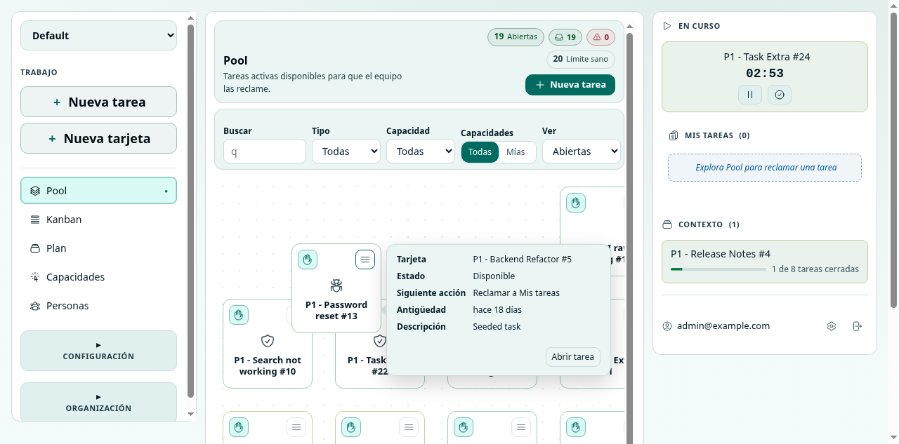

*Figura 1: Pool con filtros, tareas reclamables y panel lateral de actividad.*

### Tarea

Una tarea es una unidad de trabajo accionable. Tiene un titulo, descripcion, prioridad, tipo, tarjeta asociada, estado, propietario si esta reclamada, notas, dependencias y actividad.

Estados visibles en la interfaz:

- **Disponible:** lista para reclamar desde el Pool.
- **Reclamada:** ya esta en "Mis tareas", pero todavia no es el foco activo.
- **En curso:** una persona esta trabajando ahora en ella.
- **Cerrada:** finalizada y sin acciones pendientes.
- **Bloqueada:** no se puede reclamar o completar con normalidad porque depende de otro trabajo abierto.

La interfaz evita mezclar "reclamada" con "en curso". Una tarea reclamada esta reservada por una persona. Una tarea en curso es el foco actual de trabajo.

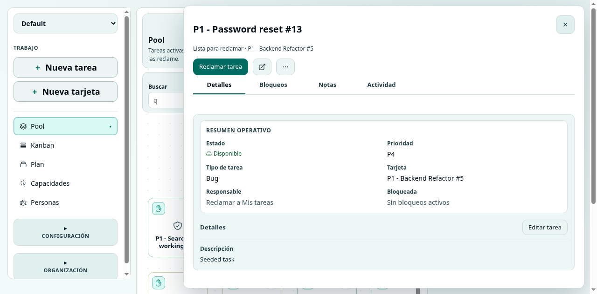

*Figura 2: Detalle de tarea con accion para reclamar, pestanas y contexto operativo.*

### Tarjeta

Una tarjeta agrupa trabajo relacionado. Puede representar una iniciativa, feature, entrega, grupo de tareas u otra unidad de planificacion definida por el proyecto. El proyecto puede tener nombres de niveles configurables. En los datos demo aparecen niveles como "Initiative", "Feature" y "Task group".

Las tarjetas pueden estar:

- **Por iniciar:** preparadas pero no activas.
- **Activas:** pueden recibir tareas y participar en el flujo.
- **Cerradas:** finalizadas.

Una regla importante observada en la interfaz: las tareas nuevas se crean dentro de una **tarjeta activa**. Si una tarjeta no esta activa, esta cerrada o contiene subtarjetas donde no corresponde crear tareas directas, la interfaz bloquea o avisa.

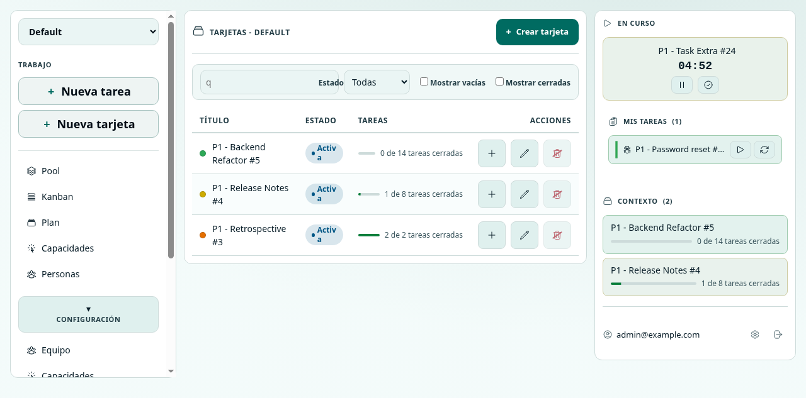

*Figura 3: Configuracion de tarjetas con estado, progreso y acciones.*

### Capacidad

Una capacidad representa una especializacion, por ejemplo Engineering, QA, Design, Security, Product u Operations. Las capacidades ayudan a que cada persona encuentre trabajo compatible con su perfil sin que un manager tenga que asignar tareas directamente.

ScrumBringer usa capacidades en dos direcciones:

- Las tareas o tipos de tarea pueden tener una capacidad asociada.
- Las personas pueden tener capacidades asignadas en un proyecto.

Esto permite filtrar el Pool por "todas" o "mias". En la vista de Capacidades, el trabajo se agrupa por especialidad y tarjeta, facilitando que una persona busque tareas que encajan con su rol.

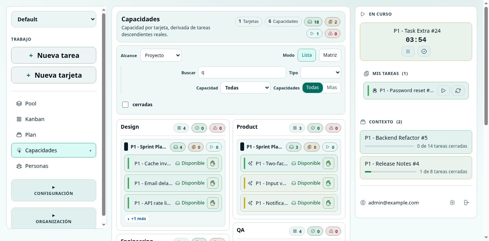

*Figura 4: Trabajo agrupado por capacidades, con tareas reclamables y tareas ya reclamadas.*

### Personas

La vista Personas muestra el estado operativo del equipo. No esta pensada para asignar trabajo a la fuerza, sino para entender carga, disponibilidad, bloqueos y foco actual.

En la vista observada aparecen:

- Personas con trabajo en curso.
- Personas con tareas reclamadas.
- Personas que requieren atencion.
- Personas disponibles.
- Busqueda por persona, tarea o tarjeta.
- Filtros como Todos, Con trabajo, Atencion y Disponibles.
- Orden por Atencion, Nombre o Mas reclamadas.

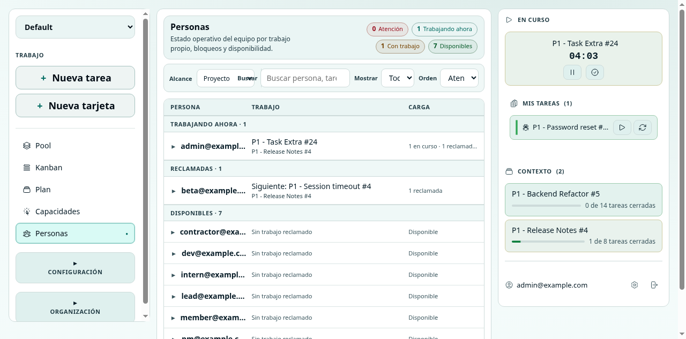

*Figura 5: Estado operativo de personas, carga y siguiente trabajo visible.*

### Workflow

En ScrumBringer, un workflow no mueve tarjetas entre columnas para simular un proceso pesado. El workflow crea trabajo nuevo en el Pool cuando ocurre un evento. La interfaz de automatizaciones lo expresa de forma directa: "Crea trabajo automatico en el Pool sin asignarlo a nadie."

La consecuencia es importante: una automatizacion puede generar una tarea, pero no la empuja a una persona concreta. La tarea aparece en el Pool, queda visible y alguien la reclama cuando corresponde.

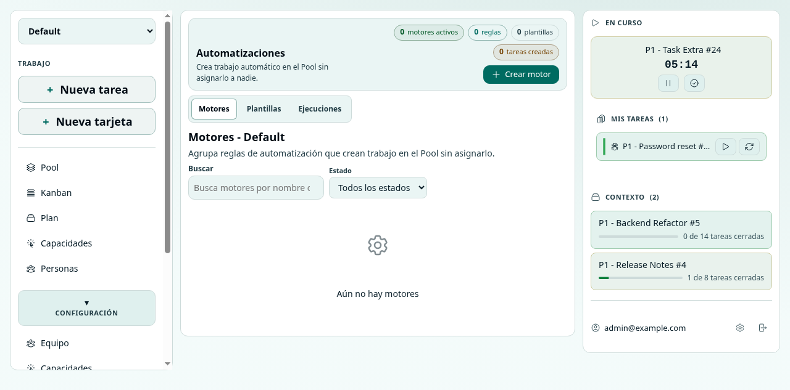

*Figura 6: Automatizaciones con motores, plantillas y ejecuciones.*

---

## Acceso y primeros pasos

### Abrir ScrumBringer

Para entrar en ScrumBringer, abre la URL de la aplicacion en un navegador moderno.

Las capturas de este manual se realizaron en un entorno local de desarrollo. En produccion, usa la URL proporcionada por tu organizacion.

### Iniciar sesion

1. Abre la pagina de acceso.
2. Escribe tu email en el campo **Email**.
3. Escribe tu contrasena en el campo **Contrasena**.
4. Pulsa **Acceso**.

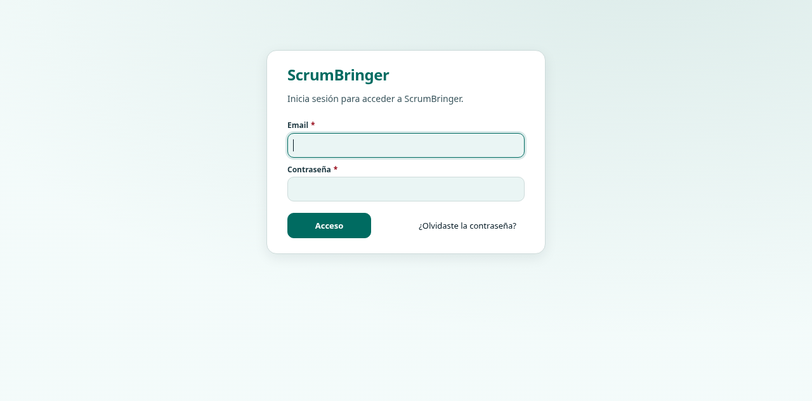

*Figura 7: Pantalla de acceso con email, contrasena y recuperacion de contrasena.*

Resultado esperado: la aplicacion abre el area de trabajo y muestra el proyecto seleccionado, el menu lateral y el Pool.

Si ves el mensaje **Credenciales invalidas**, revisa email y contrasena. Si no recuerdas la contrasena, usa el flujo de recuperacion.

### Recuperar contrasena

1. En la pantalla de acceso, pulsa **Olvidaste la contrasena?**.
2. Escribe tu email.
3. Pulsa **Generar enlace de restablecimiento**.
4. Copia el enlace generado si aparece.
5. Abre el enlace y define una nueva contrasena.

En el entorno observado, la pantalla muestra un aviso: el envio de email no esta conectado y el sistema genera un enlace que se puede copiar. En produccion, sigue el canal configurado por tu organizacion.

### Aceptar una invitacion

Si recibes una invitacion, el enlace te lleva a `/accept-invite?token=...`.

1. Abre el enlace de invitacion.
2. Si el token es valido, veras el email asociado.
3. Define una contrasena.
4. Pulsa **Registrarse**.

La interfaz exige una contrasena de al menos 12 caracteres. Tu organizacion puede definir politicas adicionales fuera de ScrumBringer.

### Restablecer contrasena

El enlace de restablecimiento usa la ruta `/reset-password?token=...`.

1. Abre el enlace.
2. Si el token es valido, escribe la nueva contrasena.
3. Pulsa **Guardar nueva contrasena**.
4. Vuelve a iniciar sesion.

Si falta el token, veras **Falta el token de restablecimiento**. Si el token no es valido, la pantalla muestra el error devuelto por el servidor.

---

## Navegacion general

### Estructura de la pantalla

En escritorio, ScrumBringer usa una estructura de tres zonas:

- **Panel izquierdo:** proyecto activo, navegacion de trabajo, configuracion y organizacion.
- **Panel central:** vista principal seleccionada.
- **Panel derecho:** actividad propia, tareas en curso, mis tareas, contexto, preferencias y salida.

La aplicacion tambien tiene un enlace **Saltar al contenido** para mejorar la navegacion con teclado.

### Selector de proyecto

El selector de proyecto aparece arriba en el panel izquierdo. Cambiar de proyecto cambia el trabajo visible, las tarjetas, capacidades, miembros y configuraciones asociadas.

Usalo cuando:

- Participas en varios proyectos.
- Necesitas configurar otro proyecto.
- Quieres revisar la carga de trabajo de otro contexto.

Si no ves ningun proyecto, la aplicacion muestra mensajes como **Pide a un admin que te anada a un proyecto**.

### Seccion Trabajo

La seccion Trabajo incluye:

- **Nueva tarea:** abre el formulario de creacion de tarea.
- **Nueva tarjeta:** abre el formulario de creacion de tarjeta.
- **Pool:** trabajo disponible para reclamar.
- **Kanban:** tarjetas por estado.
- **Plan:** arbol o estructura de tarjetas.
- **Capacidades:** trabajo agrupado por especialidad.
- **Personas:** carga y foco del equipo.

Estas vistas estan orientadas a la ejecucion diaria. El equipo deberia pasar la mayor parte del tiempo aqui.

### Seccion Configuracion

La seccion Configuracion aparece para personas con permisos de manager de proyecto u org admin. Incluye:

- **Equipo:** miembros del proyecto, roles, capacidades y liberacion de tareas reclamadas.
- **Capacidades:** creacion y mantenimiento de especializaciones del proyecto.
- **Tarjetas:** gestion de tarjetas, estados, progreso y filtros.
- **Tipos de Tarea:** tipos como Bug, Feature, QA, Security o Task, con icono y capacidad.
- **Automatizaciones:** motores, plantillas y ejecuciones que crean trabajo en el Pool.

### Seccion Organizacion

La seccion Organizacion aparece para administradores de organizacion. Incluye:

- **Invitaciones:** enlaces de invitacion por email.
- **Usuarios:** usuarios de la organizacion y rol org.
- **Proyectos:** proyectos, numero de miembros, fecha de creacion y rol propio.
- **Equipo:** vista transversal por proyecto o persona.
- **Tokens API:** integraciones tecnicas.
- **Metricas Org:** metricas globales.

### Preferencias y salida

En el panel derecho aparece **Preferencias**, con controles de tema e idioma, y **Salir**, que cierra la sesion.

---

## Pantallas principales

### Pool

El Pool es la pantalla principal para elegir trabajo. Muestra tareas abiertas con prioridad, titulo y acciones.

Controles observados:

- **Buscar:** filtra por texto.
- **Tipo:** filtra por tipo de tarea.
- **Capacidad:** filtra por especialidad.
- **Todas / Mias:** cambia el alcance de capacidades.
- **Ver:** permite ver Abiertas, Reclamables o Bloqueadas.
- **Lienzo / Lista:** cambia la presentacion.
- **Reclamar:** mueve una tarea disponible a Mis tareas.
- **Abrir tarea:** abre el detalle.

Uso recomendado:

1. Revisa primero tareas de mayor prioridad.
2. Filtra por **Mias** si quieres trabajo alineado con tus capacidades.
3. Abre el detalle si necesitas contexto.
4. Reclama solo cuando tengas intencion real de trabajar en ella.
5. Si no puedes avanzar, libera la tarea para que vuelva al Pool.

### Nueva tarea

El formulario de nueva tarea incluye:

- **Titulo:** obligatorio, maximo observado de 56 caracteres.
- **Descripcion:** contexto adicional.
- **Prioridad:** numero de 1 a 5, donde 1 es la mas alta y 5 la mas baja.
- **Tipo:** obligatorio.
- **Tarjeta activa:** obligatoria.

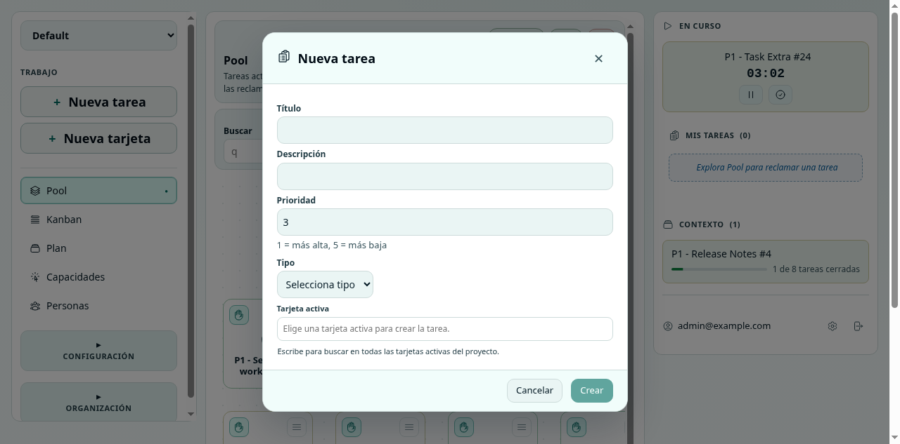

*Figura 8: Formulario de creacion de tarea con tarjeta activa obligatoria.*

La aplicacion bloquea el boton **Crear** si falta informacion obligatoria. Tambien avisa si la tarjeta elegida no puede recibir tareas.

### Detalle de tarea

El detalle de tarea concentra la conversacion y el estado operativo.

Pestanas observadas:

- **Detalles:** informacion principal, estado, propietario y accion siguiente.
- **Bloqueos:** dependencias que impiden avanzar.
- **Notas:** decisiones, contexto o avances.
- **Actividad:** historial de cambios y eventos.

Acciones observadas:

- **Reclamar tarea.**
- **Empezar a trabajar.**
- **Pausar.**
- **Cerrar tarea.**
- **Liberar.**
- **Editar tarea.**
- **Abrir en.**
- **Acciones.**

Uso recomendado:

- Usa **Notas** para registrar decisiones importantes.
- Usa **Bloqueos** cuando el orden del trabajo dependa de otra tarea.
- Usa **Actividad** para entender que paso antes de preguntar al equipo.
- Evita cerrar una tarea si todavia quedan dependencias o acuerdos pendientes.

### Mis tareas y En curso

El panel derecho separa dos estados:

- **Mis tareas:** tareas que has reclamado pero no necesariamente estas ejecutando ahora.
- **En curso:** foco activo actual.

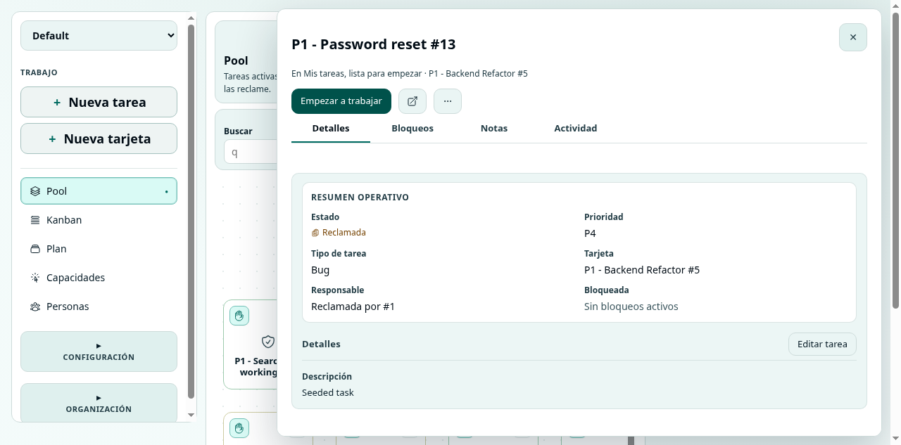

*Figura 9: Tarea reclamada y visible en Mis tareas.*

Esta separacion evita que todas las tareas reclamadas parezcan trabajo activo. Una persona puede tener varias tareas reservadas, pero solo deberia tener un foco claro en curso.

### Kanban

Kanban muestra tarjetas por estado. En los datos demo aparecen columnas como **Por iniciar** y **Activa**.

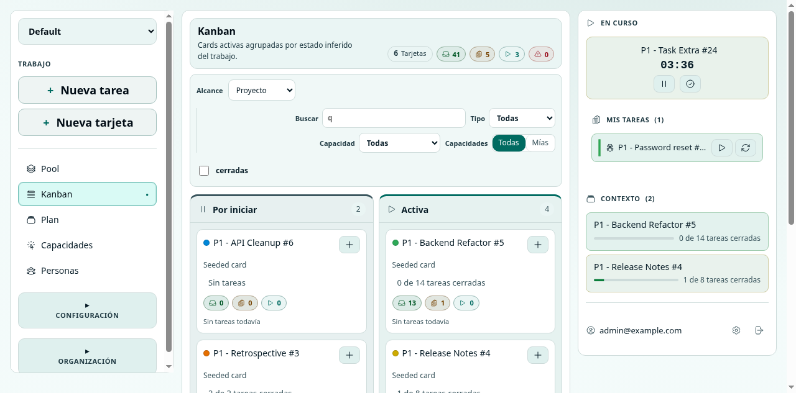

*Figura 10: Kanban de tarjetas por estado.*

Usa Kanban para:

- Revisar que tarjetas estan activas.
- Ver que tarjetas aun no han empezado.
- Abrir una tarjeta.
- Crear una tarea dentro de una tarjeta activa.
- Detectar tarjetas que tienen mucho trabajo acumulado.

Kanban en ScrumBringer no sustituye al Pool. El Pool es donde se reclama trabajo; Kanban ayuda a entender el estado de las tarjetas que agrupan ese trabajo.

### Plan

Plan muestra la estructura de tarjetas como arbol o tabla. Permite revisar niveles, subtarjetas, trabajo directo y acciones.

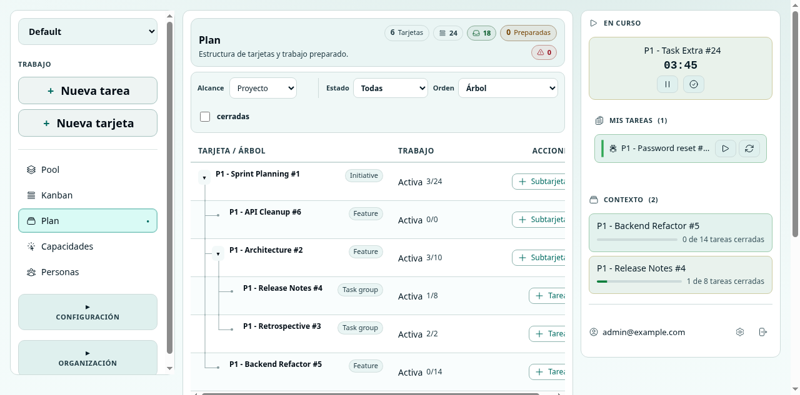

*Figura 11: Vista Plan con jerarquia de tarjetas y progreso.*

Usa Plan para:

- Entender la estructura del proyecto.
- Revisar donde vive una tarea.
- Ver subtarjetas dentro de una iniciativa.
- Crear subtarjetas o tareas en el contexto correcto.
- Revisar tarjetas cerradas si activas el filtro correspondiente.

### Capacidades

Capacidades muestra el trabajo organizado por especializacion. En la captura, las tareas se agrupan por Design, Engineering, Operations, Product, QA y Security.

Usa esta vista para:

- Encontrar trabajo que encaja con tu perfil.
- Detectar capacidades con demasiado trabajo disponible.
- Ver si una tarea ya fue reclamada por alguien.
- Reclamar una tarea desde el contexto de especializacion.

Esta pantalla es clave para mantener la autoasignacion sin perder control de especializacion.

### Personas

Personas muestra carga, foco activo y disponibilidad del equipo.

Usa esta vista para:

- Ver quien esta trabajando ahora.
- Detectar personas con trabajo bloqueado.
- Ver quien tiene tareas reclamadas.
- Encontrar personas disponibles.
- Revisar carga por tarjeta o alcance.

Esta vista fomenta conversacion. Si alguien aparece con mucha carga o atencion, la accion recomendada no es reasignar de forma silenciosa; es hablar con la persona o revisar el pool y los bloqueos.

### Configuracion de equipo

La pantalla Equipo de Configuracion muestra miembros del proyecto, rol, numero de capacidades, tareas reclamadas y acciones.

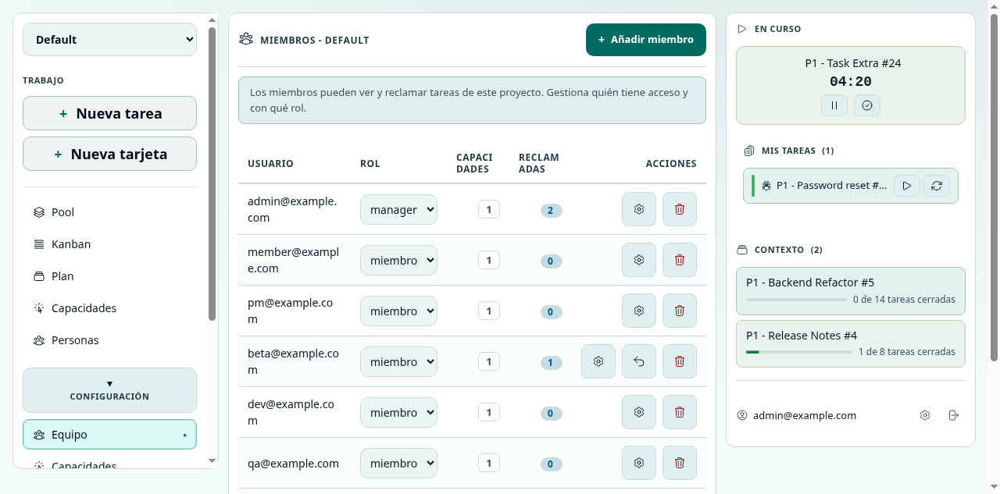

*Figura 12: Miembros del proyecto con rol, capacidades y tareas reclamadas.*

Acciones observadas:

- **Anadir miembro.**
- Cambiar rol entre miembro y manager, cuando se tienen permisos.
- **Gestionar capacidades.**
- **Liberar todas** las tareas reclamadas de otra persona, si corresponde.
- **Quitar** miembro.

La accion **Liberar todas** es una herramienta de desbloqueo. Debe usarse con cuidado y preferiblemente despues de hablar con la persona afectada.

### Configuracion de capacidades

La pantalla Capacidades permite crear, editar, eliminar y gestionar miembros por capacidad.

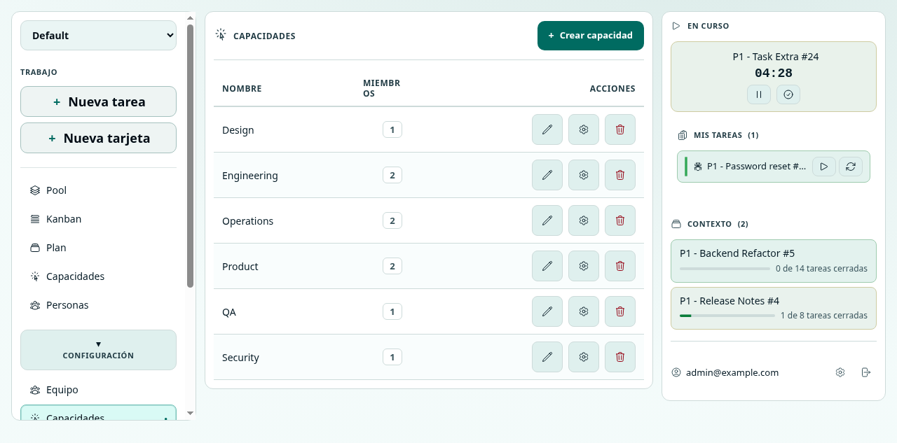

*Figura 13: Capacidades del proyecto y numero de miembros por capacidad.*

Uso recomendado:

- Mantener capacidades pocas y comprensibles.
- Evitar crear capacidades tan especificas que nadie pueda reclamar trabajo.
- Revisar capacidades cuando el Pool muestra mucho trabajo sin reclamar.
- Asignar capacidades segun habilidades reales, no como jerarquia de autoridad.

### Configuracion de tarjetas

La pantalla Tarjetas lista tarjetas, estado, progreso y acciones.

Acciones observadas:

- **Crear tarjeta.**
- Buscar por texto.
- Filtrar por estado.
- Mostrar u ocultar tarjetas vacias.
- Mostrar u ocultar tarjetas cerradas.
- Abrir tarjeta.
- Anadir tarea a una tarjeta.
- Editar tarjeta.
- Eliminar tarjeta, si no tiene tareas o historial que lo impida.

### Automatizaciones

La pantalla Automatizaciones tiene tres modos:

- **Motores:** agrupan reglas.
- **Plantillas:** definen tareas reutilizables.
- **Ejecuciones:** muestran eventos aplicados o ignorados.

La idea principal es que las automatizaciones crean trabajo disponible, no asignado. Por ejemplo, una regla puede crear una tarea de QA cuando se cierre una tarea de desarrollo. Esa tarea de QA queda en el Pool para que alguien con capacidad QA la reclame.

### Organizacion: proyectos e invitaciones

La pantalla Proyectos muestra proyectos de la organizacion, miembros, fecha de creacion, rol propio y acciones.

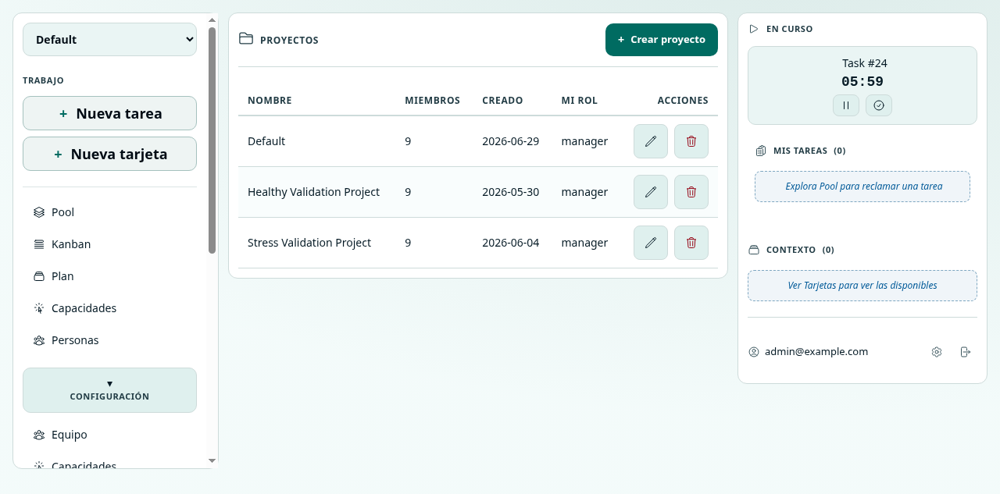

*Figura 14: Gestion de proyectos a nivel organizacion.*

La pantalla Invitaciones permite crear enlaces de invitacion por email.

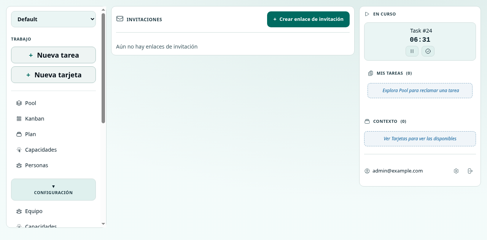

*Figura 15: Gestion de invitaciones de organizacion.*

---

## Flujos paso a paso

### Flujo 1: entrar y elegir proyecto

1. Abre ScrumBringer.
2. Inicia sesion con email y contrasena.
3. En el selector superior izquierdo, confirma que estas en el proyecto correcto.
4. Si perteneces a varios proyectos, abre el selector y elige otro.
5. Espera a que el Pool y el panel derecho se actualicen.

Resultado esperado: ves tareas y tarjetas del proyecto elegido.

Si no aparecen tareas, puede ser normal. Revisa si hay filtros activos, si el proyecto no tiene trabajo abierto o si necesitas que un manager cree tarjetas y tareas.

### Flujo 2: encontrar una tarea para trabajar

1. Entra en **Pool**.
2. Revisa las tareas abiertas por prioridad.
3. Usa **Tipo** si buscas, por ejemplo, Bug, Feature o QA.
4. Usa **Capacidad** si quieres un area concreta.
5. Pulsa **Mias** para limitar a tus capacidades.
6. Cambia **Ver** a Reclamables si quieres ocultar bloqueadas.
7. Abre una tarea para leer detalles.

Resultado esperado: identificas una tarea lista para reclamar.

Consejo: si una tarea parece importante pero esta bloqueada, no la reclames sin revisar dependencias. Abrela y mira la pestana **Bloqueos**.

### Flujo 3: reclamar una tarea

1. En el Pool, localiza una tarea.
2. Pulsa **Reclamar** o abre la tarea y pulsa **Reclamar tarea**.
3. Comprueba que la tarea desaparece del Pool de disponibles.
4. Revisa el panel derecho.
5. La tarea debe aparecer en **Mis tareas**.

Resultado esperado: la tarea pasa de disponible a reclamada por ti.

Este flujo es el centro de ScrumBringer. No esperas a que alguien te asigne la tarea. La reclamas cuando tienes contexto, capacidad y disponibilidad.

### Flujo 4: empezar a trabajar

1. Reclama una tarea.
2. En el panel derecho, busca la tarea en **Mis tareas**.
3. Pulsa **Empezar**.
4. La tarea pasa a **En curso**.

Resultado esperado: la tarea queda marcada como foco activo.

Si ya tienes otra tarea en curso, revisa antes si debes pausarla. La interfaz observada muestra acciones de **Pausar** y **Cerrar tarea** para el trabajo activo.

### Flujo 5: pausar una tarea

1. En el panel derecho, localiza **En curso**.
2. Pulsa **Pausar**.
3. La tarea deja de ser foco activo.
4. Si sigue reclamada, queda en **Mis tareas**.

Resultado esperado: el equipo deja de ver esa tarea como foco actual.

Usa Pausar cuando interrumpes el trabajo pero sigues siendo responsable de retomarlo.

### Flujo 6: liberar una tarea

1. En **Mis tareas**, localiza la tarea.
2. Pulsa **Liberar**.
3. Confirma si la aplicacion lo solicita.
4. La tarea vuelve al Pool.

Resultado esperado: otra persona puede reclamar la tarea.

Liberar no es un fallo. Es una forma explicita de devolver trabajo al equipo cuando cambia tu disponibilidad, aparece un bloqueo personal o alguien con mejor capacidad puede tomarlo.

### Flujo 7: cerrar una tarea

1. Abre la tarea o usa el panel derecho si esta en curso.
2. Revisa detalles, notas y bloqueos.
3. Si el trabajo esta completo, pulsa **Cerrar tarea**.
4. Verifica que la tarea pasa a cerrada.

Resultado esperado: la tarea queda finalizada.

Antes de cerrar, comprueba si hay tareas dependientes o trabajo generado por automatizaciones. Si cerrar una tarea dispara reglas, puede aparecer trabajo nuevo en el Pool.

### Flujo 8: crear una tarea manual

1. Pulsa **Nueva tarea**.
2. Escribe un titulo claro.
3. Anade descripcion si ayuda al equipo.
4. Define prioridad entre 1 y 5.
5. Elige tipo de tarea.
6. Elige una tarjeta activa.
7. Pulsa **Crear**.

Resultado esperado: la tarea queda creada y aparece en el Pool si encaja con los filtros actuales.

Si la tarea no aparece, revisa:

- Filtros activos.
- Tipo o capacidad seleccionados.
- Si la tarjeta elegida esta activa.
- Si el texto de busqueda excluye la tarea.

La interfaz puede mostrar **Tarea creada, pero no visible por filtros actuales**.

### Flujo 9: usar notas para comunicar contexto

1. Abre una tarea.
2. Entra en la pestana **Notas**.
3. Pulsa **Anadir nota**.
4. Escribe decision, avance, duda o contexto.
5. Guarda la nota.

Resultado esperado: la nota queda visible para el equipo.

Usa notas para reducir mensajes externos dispersos. Una buena nota responde "que necesita saber la siguiente persona que abra esta tarea?".

Ejemplos de notas utiles:

- "Se acordo con Producto que el alcance no incluye exportacion CSV."
- "Bloqueado hasta que se cierre la tarea de migracion de indices."
- "QA puede probar con usuario demo `qa@example.com`."

### Flujo 10: anadir una dependencia

1. Abre una tarea.
2. Entra en **Bloqueos**.
3. Pulsa **Anadir dependencia**.
4. Busca la tarea de la que depende.
5. Seleccionala y guarda.

Resultado esperado: la tarea queda bloqueada hasta que la dependencia se cierre.

Usa dependencias solo cuando el orden de trabajo importa de verdad. Si solo necesitas una conversacion, usa notas o habla con el equipo.

### Flujo 11: revisar trabajo por tarjeta

1. Entra en **Kanban** para ver tarjetas por estado.
2. Abre una tarjeta activa.
3. Revisa tareas directas, progreso y contexto.
4. Si la tarjeta puede recibir trabajo, pulsa **Anadir tarea**.
5. Si necesitas estructura, entra en **Plan** para ver subtarjetas.

Resultado esperado: entiendes donde vive el trabajo y puedes crear tareas en el nivel correcto.

### Flujo 12: revisar estructura del proyecto en Plan

1. Entra en **Plan**.
2. Elige alcance: Proyecto, Nivel o Tarjeta.
3. Usa el filtro de estado si necesitas ver solo tarjetas activas.
4. Expande o colapsa nodos del arbol.
5. Abre tarjetas para ver detalle.

Resultado esperado: ves la jerarquia de trabajo sin convertir cada nivel en una cola de asignacion.

### Flujo 13: encontrar trabajo por capacidad

1. Entra en **Capacidades**.
2. Selecciona **Mias** si quieres ver solo capacidades propias.
3. Usa filtros de tipo, capacidad y busqueda.
4. Revisa tareas bajo tu especialidad.
5. Reclama una tarea si estas disponible.

Resultado esperado: encuentras trabajo alineado con tu especializacion.

Este flujo sustituye una practica comun de asignacion directa. En lugar de que un manager asigne todos los bugs de seguridad a una persona, las tareas de Security quedan visibles y las personas con esa capacidad las reclaman.

### Flujo 14: revisar carga del equipo

1. Entra en **Personas**.
2. Filtra por **Atencion** para ver posibles problemas.
3. Filtra por **Disponibles** para encontrar personas sin trabajo reclamado.
4. Expande una persona para ver su estado.
5. Abre tareas o tarjetas relacionadas.

Resultado esperado: el equipo entiende carga y bloqueos sin usar asignaciones forzadas.

Si alguien tiene demasiadas tareas reclamadas, habla con esa persona. Puede liberar trabajo o pedir ayuda. La herramienta muestra la situacion; el equipo resuelve con comunicacion.

### Flujo 15: anadir un miembro al proyecto

Este flujo requiere permisos de manager de proyecto u org admin.

1. Entra en **Configuracion > Equipo**.
2. Pulsa **Anadir miembro**.
3. Busca por email.
4. Selecciona la persona.
5. Elige rol: miembro o manager.
6. Guarda.

Resultado esperado: la persona aparece en la lista de miembros del proyecto.

Si no aparece en la busqueda, puede que no exista como usuario de organizacion. En ese caso, un org admin debe crear o enviar invitacion.

### Flujo 16: asignar capacidades a una persona

1. Entra en **Configuracion > Equipo**.
2. Busca la persona.
3. Pulsa **Gestionar capacidades**.
4. Marca las capacidades correspondientes.
5. Pulsa **Guardar**.

Resultado esperado: la persona puede filtrar trabajo por esas capacidades y aparece reflejada en conteos.

Recomendacion: no uses capacidades como premios o jerarquias. Usalas como senales de especializacion real.

### Flujo 17: crear una capacidad

1. Entra en **Configuracion > Capacidades**.
2. Pulsa **Crear capacidad**.
3. Escribe un nombre claro, por ejemplo "Frontend" o "QA".
4. Guarda.
5. Asigna miembros a esa capacidad.

Resultado esperado: la capacidad queda disponible para tipos de tarea y filtros.

### Flujo 18: crear o editar tarjetas

1. Entra en **Configuracion > Tarjetas**.
2. Pulsa **Crear tarjeta** o edita una existente.
3. Define titulo, descripcion y color si el formulario lo ofrece.
4. Guarda.
5. Verifica el estado y progreso en la tabla.

Resultado esperado: la tarjeta queda disponible para organizar trabajo.

### Flujo 19: configurar automatizaciones

Este flujo requiere permisos de manager de proyecto u org admin.

1. Entra en **Configuracion > Automatizaciones**.
2. Revisa la pestana **Motores**.
3. Crea o edita un motor si necesitas agrupar reglas.
4. Entra en **Plantillas** para definir que tarea se creara.
5. Crea reglas que conectan eventos con plantillas.
6. Revisa **Ejecuciones** para ver tareas creadas o eventos ignorados.

Resultado esperado: cuando ocurre el evento configurado, ScrumBringer crea una tarea nueva en el Pool.

Importante: la automatizacion crea trabajo disponible, no asignado. La tarea entra al flujo pull y alguien la reclama.

### Flujo 20: invitar una persona a la organizacion

Este flujo requiere rol de org admin.

1. Entra en **Organizacion > Invitaciones**.
2. Pulsa **Crear enlace de invitacion**.
3. Escribe el email.
4. Crea el enlace.
5. Copia el enlace y envialo por el canal acordado.

Resultado esperado: la persona puede aceptar la invitacion y crear su contrasena. Si el envio automatico de email no esta conectado, copia el enlace y envialo por el canal acordado.

### Flujo 21: crear un proyecto

Este flujo requiere rol de org admin.

1. Entra en **Organizacion > Proyectos**.
2. Pulsa **Crear proyecto**.
3. Completa el nombre.
4. Configura estructura y limite blando del Pool.
5. Revisa el resumen.
6. Crea el proyecto.

El asistente de creacion observado tiene pasos: General, Estructura y Pool, Capacidades, Equipo y Revision. Capacidades y equipo pueden configurarse despues.

Resultado esperado: el proyecto aparece en la lista y puede recibir miembros, capacidades, tarjetas y tareas.

---

## Como cambia el trabajo frente a herramientas tradicionales

### Caso 1: una tarea urgente de bug

**En una herramienta tradicional:** el lead crea una issue "Corregir login" y la asigna a una persona concreta. Si esa persona esta ocupada, el bug queda parado o requiere reasignacion manual. El resto del equipo puede no saber si realmente se esta trabajando.

**En ScrumBringer:** el lead crea una tarea con prioridad 1, tipo Bug y capacidad Engineering o Security. La tarea aparece en el Pool. Las personas con capacidad adecuada la ven al filtrar por Mias o por capacidad. Quien este disponible la reclama. Si descubre que no puede avanzar, la libera o anade un bloqueo.

Beneficio: el trabajo urgente se hace visible sin depender de una cadena de reasignaciones.

### Caso 2: QA despues de cerrar desarrollo

**En una herramienta tradicional:** una issue cambia a "Ready for QA" o se asigna a una persona de QA. Si hay varias personas de QA, alguien debe decidir manualmente.

**En ScrumBringer:** una automatizacion puede crear una nueva tarea de QA cuando se cierra una tarea de desarrollo. Esa tarea se coloca en el Pool con capacidad QA. Las personas de QA la reclaman cuando tienen disponibilidad.

Beneficio: el workflow crea el siguiente trabajo sin romper la autoasignacion.

### Caso 3: trabajo de documentacion al cerrar una feature

**En una herramienta tradicional:** se anade una subtarea y se asigna a alguien de documentacion o producto. Si no hay responsable claro, puede quedar perdida en el backlog.

**En ScrumBringer:** una regla puede crear una tarea "Actualizar notas de release" dentro de la tarjeta correspondiente. La tarea queda disponible con capacidad Product u Operations.

Beneficio: el trabajo aparece en el contexto correcto y se reclama por capacidad, no por empuje.

### Caso 4: equipo saturado

**En una herramienta tradicional:** el manager revisa asignaciones persona por persona y mueve issues entre usuarios. Esto puede generar poca autonomia y mucha coordinacion manual.

**En ScrumBringer:** el manager revisa **Personas**, **Capacidades** y metricas. Si una persona tiene demasiadas tareas reclamadas, puede conversar con ella. La persona puede liberar tareas. Si una capacidad esta saturada, el equipo ve el cuello de botella.

Beneficio: la carga se gestiona con visibilidad y conversacion.

### Caso 5: planificacion de una iniciativa

**En una herramienta tradicional:** se crean epics, stories, subtasks, estados y tableros. Con el tiempo, el proceso puede crecer mas que el trabajo real.

**En ScrumBringer:** se crean tarjetas para organizar contexto y tareas para ejecutar. Si una tarjeta necesita estructura, se usan subtarjetas. Si una tarjeta ya contiene subtarjetas, la herramienta evita mezclar tareas directas donde no corresponde.

Beneficio: el modelo se mantiene simple: tarjetas para agrupar, tareas para trabajar.

### Caso 6: traspaso entre especialidades

**En una herramienta tradicional:** una tarea se reasigna de Backend a Frontend, luego a QA, luego vuelve a Backend. El historial refleja asignaciones, pero no necesariamente aprendizaje.

**En ScrumBringer:** cada etapa puede expresarse como nueva tarea creada en el Pool, con capacidad correspondiente. El equipo ve que hay trabajo Backend, Frontend o QA disponible. Las notas y dependencias mantienen el contexto.

Beneficio: el traspaso no depende de empujar la misma unidad de trabajo entre personas.

---

## Permisos y roles

ScrumBringer distingue permisos de organizacion y permisos de proyecto.

### Rol de organizacion: admin

Un org admin puede acceder a secciones globales:

- Invitaciones.
- Usuarios y roles de organizacion.
- Proyectos.
- Equipo transversal.
- Tokens API.
- Metricas de organizacion.

Tambien puede tener acceso implicito a configuraciones de proyecto segun el modelo observado.

### Rol de organizacion: miembro

Un miembro de organizacion puede entrar en proyectos donde fue anadido. No necesariamente puede administrar la organizacion.

### Rol de proyecto: manager

Un manager de proyecto puede gestionar contenido del proyecto:

- Miembros del proyecto.
- Capacidades.
- Tipos de tarea.
- Tarjetas.
- Automatizaciones.
- Plantillas y ejecuciones de automatizacion, segun permisos.

Tambien puede realizar acciones administrativas sobre notas y estructura en tarjetas del proyecto.

### Rol de proyecto: miembro

Un miembro de proyecto puede ver y reclamar tareas del proyecto. Puede trabajar en el Pool, abrir tareas, usar notas y participar en el flujo del equipo. No tiene acceso a todas las secciones de configuracion.

### Acceso denegado

Si intentas abrir una seccion sin permiso, la interfaz muestra:

- **No permitido**
- **No tienes permiso para acceder a esta seccion.**

Si necesitas acceso, pide a un manager de proyecto o a un org admin que revise tu rol.

### Acciones sensibles

Algunas acciones deben usarse con cuidado:

- Quitar miembros del proyecto.
- Eliminar usuarios.
- Eliminar proyectos.
- Eliminar capacidades.
- Eliminar tarjetas o tipos de tarea.
- Liberar todas las tareas de otra persona.
- Revocar tokens API.

La interfaz suele pedir confirmacion o bloquear acciones cuando hay historial, tareas o reglas que lo impiden.

---

## Errores frecuentes y como resolverlos

### No puedo iniciar sesion

**Sintomas:** aparece **Credenciales invalidas**.

**Causas posibles:**

- Email incorrecto.
- Contrasena incorrecta.
- Usuario no registrado.

**Solucion:**

1. Revisa email y contrasena.
2. Usa recuperacion de contrasena.
3. Si no tienes cuenta, pide una invitacion.

### Falta email o contrasena

**Sintomas:** aparece **Email y contrasena requeridos** o **El email es obligatorio**.

**Solucion:**

1. Completa ambos campos.
2. Verifica que el email tenga formato valido.
3. Vuelve a enviar.

### No veo proyectos

**Sintomas:** aparece **Pide a un admin que te anada a un proyecto**.

**Solucion:**

1. Contacta con un org admin o manager.
2. Pide que te anadan al proyecto correcto.
3. Si ya te anadieron, cierra sesion y vuelve a entrar.

### No veo tareas en el Pool

**Sintomas:** aparece **No hay tareas disponibles ahora**, **Ninguna tarea coincide con tus filtros** o **No hay tareas abiertas en el Pool**.

**Causas posibles:**

- Filtros activos.
- No hay tareas abiertas.
- Solo hay tareas bloqueadas.
- Estas filtrando por capacidades que no tienen trabajo.

**Solucion:**

1. Pulsa **Limpiar** si esta disponible.
2. Cambia **Ver** a Abiertas.
3. Cambia capacidad a Todas.
4. Borra la busqueda.
5. Revisa si las tareas estan bloqueadas.

### No puedo reclamar una tarea

**Sintomas:** la tarea aparece bloqueada o el boton no esta disponible.

**Causas posibles:**

- Tiene dependencias abiertas.
- Otra persona ya la reclamo.
- Fue modificada y necesitas recargar.

**Solucion:**

1. Abre el detalle.
2. Revisa **Bloqueos**.
3. Si aparece **La tarea ya esta reclamada por otro usuario**, habla con esa persona.
4. Si aparece **La tarea fue modificada. Por favor recarga**, recarga la pagina.

### Cree una tarea pero no la veo

**Sintomas:** aparece **Tarea creada, pero no visible por filtros actuales**.

**Causas posibles:**

- El filtro de tipo no incluye la tarea.
- El filtro de capacidad no incluye la tarea.
- La busqueda no coincide.
- Estas viendo solo bloqueadas o reclamables.

**Solucion:**

1. Limpia filtros.
2. Cambia a **Abiertas**.
3. Busca por el titulo exacto.
4. Revisa la tarjeta donde la creaste.

### No puedo crear una tarea

**Sintomas:** el boton **Crear** esta deshabilitado o aparece un aviso.

**Causas posibles:**

- Falta titulo.
- Falta tipo.
- Prioridad fuera de rango.
- No elegiste tarjeta activa.
- La tarjeta elegida no puede recibir tareas.

**Solucion:**

1. Escribe titulo.
2. Selecciona tipo.
3. Usa prioridad entre 1 y 5.
4. Elige una tarjeta activa.
5. Si la tarjeta tiene subtarjetas, crea la tarea en una tarjeta hoja adecuada.

### La tarjeta no puede recibir tareas

**Mensajes observados:**

- **Solo las tarjetas activas pueden recibir tareas nuevas.**
- **Las tarjetas cerradas no pueden recibir tareas nuevas.**
- **Esta tarjeta ya contiene tarjetas hijas. Anade la tarea a un grupo de tareas o elige una tarjeta vacia.**

**Solucion:**

1. Elige una tarjeta activa.
2. Si la tarjeta contiene subtarjetas, entra en la subtarjeta adecuada.
3. Pide a un manager que revise estructura si no hay tarjeta valida.

### No puedo eliminar una tarjeta o tipo de tarea

**Sintomas:** el boton aparece bloqueado o se muestra un mensaje como **No se puede eliminar: tiene tareas**.

**Causa:** hay historial operativo o tareas asociadas.

**Solucion:**

1. Cierra el trabajo pendiente.
2. Si la tarjeta tiene historial, cierrala en lugar de eliminarla.
3. Usa eliminacion solo para elementos creados por error y sin uso.

### No puedo degradar o eliminar un admin

**Sintomas:** aparece un error relacionado con el ultimo admin.

**Causa:** la aplicacion protege contra quedarse sin administradores.

**Solucion:**

1. Anade otro admin primero.
2. Confirma que hay al menos un admin activo.
3. Reintenta el cambio.

### No puedo liberar mis propias tareas desde administracion

**Sintomas:** aparece **No puedes liberar tus propias tareas**.

**Causa:** la accion administrativa **Liberar todas** esta pensada para liberar tareas de otra persona.

**Solucion:**

1. Ve a tu panel derecho.
2. Libera tus tareas una a una desde **Mis tareas**.

### El enlace de invitacion no funciona

**Sintomas:** la pantalla indica token faltante, invalido, usado o expirado.

**Solucion:**

1. Pide un enlace nuevo.
2. Asegurate de abrir el enlace completo.
3. Si ya se uso, solicita regeneracion.

### Un token API deja de funcionar

**Sintomas:** una integracion externa falla despues de revocar un token.

**Causa:** los tokens revocados dejan de funcionar. La interfaz indica que los permisos de token son inmutables: para cambiar alcance, proyecto o expiracion hay que revocar y crear otro.

**Solucion:**

1. Crea un token nuevo.
2. Copialo en el momento de creacion.
3. Actualiza la integracion externa.

---

## FAQ

### ScrumBringer asigna tareas automaticamente?

No en el sentido tradicional. ScrumBringer puede crear tareas automaticamente mediante workflows, pero esas tareas quedan disponibles en el Pool. Una persona las reclama.

### Cual es la diferencia entre reclamar y empezar?

Reclamar mueve la tarea a **Mis tareas** y senala que te responsabilizas de ella. Empezar la convierte en tu foco **En curso**.

### Puedo tener varias tareas reclamadas?

Si. La interfaz muestra conteos de tareas reclamadas. Aun asi, conviene mantener pocas tareas reclamadas para no bloquear al equipo.

### Que hago si reclame una tarea y no puedo continuar?

Anade una nota si hay contexto importante y pulsa **Liberar**. La tarea vuelve al Pool para que otra persona pueda reclamarla.

### Que hago si una tarea esta bloqueada?

Abre la tarea y revisa **Bloqueos**. Si depende de otra tarea, espera a que se cierre o ayuda a resolverla. Si el bloqueo es conversacional, deja una nota y habla con el equipo.

### Cuando creo una tarjeta y cuando creo una tarea?

Crea una tarjeta cuando necesitas agrupar trabajo o representar una parte del plan. Crea una tarea cuando hay una unidad concreta que alguien puede reclamar y completar.

### Puedo crear tareas fuera de una tarjeta?

En la interfaz observada, no. La creacion de tareas exige una **tarjeta activa**.

### Que significa capacidad?

Una capacidad es una especializacion necesaria para hacer cierto trabajo. Sirve para filtrar y organizar tareas, no para imponer jerarquia.

### Por que no puedo ver una seccion de configuracion?

Probablemente no tienes permisos. Las secciones de configuracion requieren rol de manager de proyecto u org admin, segun la seccion.

### Que pasa si una automatizacion crea muchas tareas?

Las tareas aparecen en el Pool. La interfaz incluye avisos sobre ruido cuando una regla puede crear mucho trabajo al activar tarjetas con muchas subtarjetas. Revisa motores, reglas y ejecuciones.

### Las notas se pueden editar?

La interfaz observada permite anadir, fijar/desfijar y eliminar notas segun permisos. Trata las notas como contexto operativo: si necesitas corregir una decision, anade una nota nueva que deje trazabilidad.

### ScrumBringer sustituye reuniones de equipo?

No. ScrumBringer hace visible trabajo, bloqueos, carga y contexto. La comunicacion sigue siendo necesaria, especialmente al liberar trabajo, resolver bloqueos o ajustar capacidades.

### Que vista debo usar cada dia?

Usa **Pool** para elegir trabajo, **Mis tareas** para gestionar lo reclamado, **Personas** para entender carga y **Capacidades** cuando quieras filtrar por especializacion.

### Que vista debe mirar un manager?

Un manager deberia mirar **Pool**, **Personas**, **Capacidades**, **Plan**, metricas y configuracion del proyecto. El objetivo no es asignar cada tarea, sino mantener sano el flujo.

### Puedo cambiar idioma o tema?

Si. En el panel derecho, abre **Preferencias**. La interfaz observada incluye tema e idioma.

### Que hago si veo "No permitido"?

Pide a un org admin o manager que revise tu rol. No intentes saltarte la seccion con enlaces directos; la aplicacion tambien valida permisos.

---

## Glosario

**Autoasignacion:** forma de trabajo en la que una persona reclama una tarea disponible en lugar de recibirla asignada directamente.

**Bloqueo:** situacion que impide avanzar una tarea, normalmente por una dependencia abierta.

**Capacidad:** especializacion asociada a tareas y personas, como Engineering, QA o Design.

**En curso:** tarea que es foco activo de una persona.

**Liberar:** devolver una tarea reclamada al Pool.

**Manager de proyecto:** rol con permisos para configurar equipo y contenido del proyecto.

**Miembro de proyecto:** persona que puede ver y reclamar trabajo en un proyecto.

**Mis tareas:** tareas reclamadas por la persona actual.

**Org admin:** administrador de organizacion con acceso a secciones globales.

**Pool:** espacio compartido donde aparecen tareas abiertas disponibles para reclamar.

**Reclamar:** tomar propiedad temporal de una tarea y moverla a Mis tareas.

**Tarjeta:** agrupador de trabajo relacionado.

**Tarea:** unidad de trabajo que una persona puede reclamar, ejecutar y cerrar.

**Workflow:** automatizacion que crea nuevas tareas en el Pool cuando ocurren eventos definidos.

---

## Anexo: capturas incluidas

Las capturas estan en `docs/user_guide/`:

1. `01-acceso.png`
2. `02-pool.png`
3. `03-nueva-tarea.png`
4. `04-detalle-tarea.png`
5. `05-tarea-reclamada.png`
6. `06-kanban.png`
7. `07-plan.png`
8. `08-capacidades.png`
9. `09-personas.png`
10. `10-config-equipo.png`
11. `11-config-capacidades.png`
12. `12-config-tarjetas.png`
13. `13-automatizaciones.png`
14. `14-org-proyectos.png`
15. `15-org-invitaciones.png`

---

## Evidencia usada para redactar este manual

Este manual se baso en:

- Rutas de la aplicacion: `/`, `/accept-invite`, `/reset-password`, `/app/pool`, `/config/members`, `/config/capabilities`, `/config/task-types`, `/config/cards`, `/config/workflows`, `/org/invites`, `/org/settings`, `/org/projects`, `/org/team`, `/org/api-tokens`, `/org/metrics`.
- Textos visibles de la interfaz en espanol.
- Componentes de autenticacion, pool, detalle de tarea, plan, kanban, capacidades, personas, administracion y organizacion.
- Formularios observados de acceso, recuperacion, nueva tarea, invitaciones, proyectos, miembros, capacidades y configuracion.
- Capturas de navegador tomadas contra datos demo locales el 2026-06-29.
