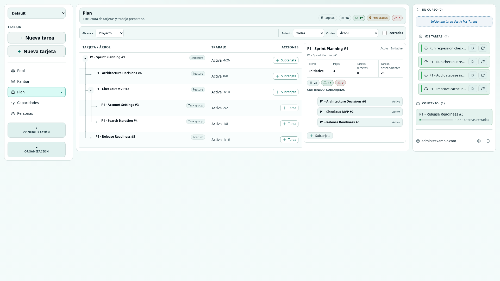
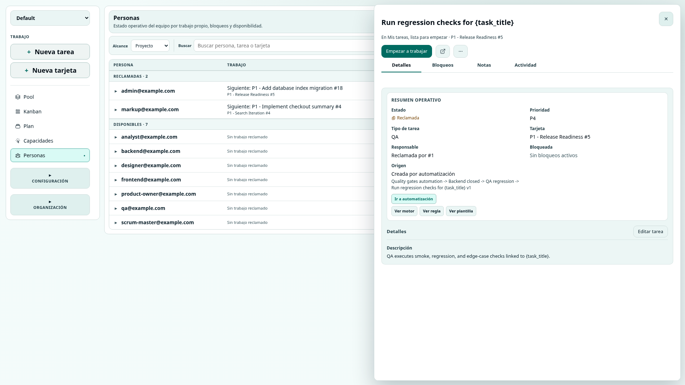
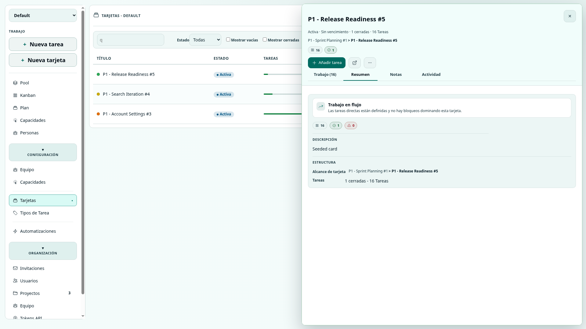
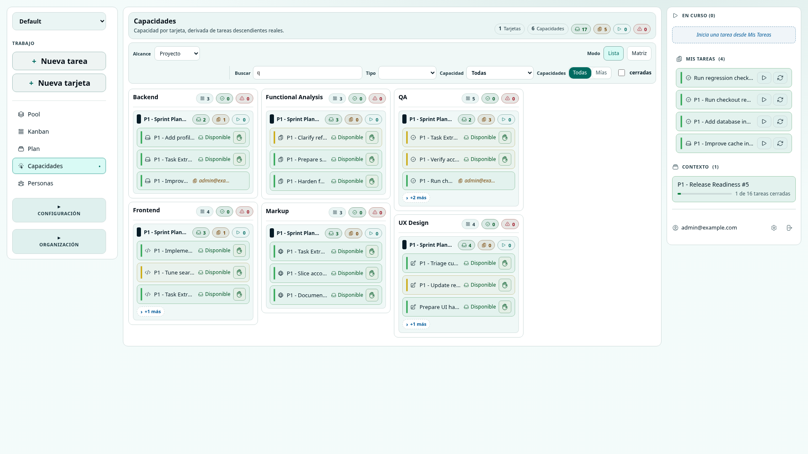
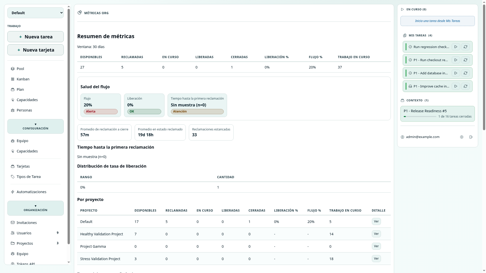
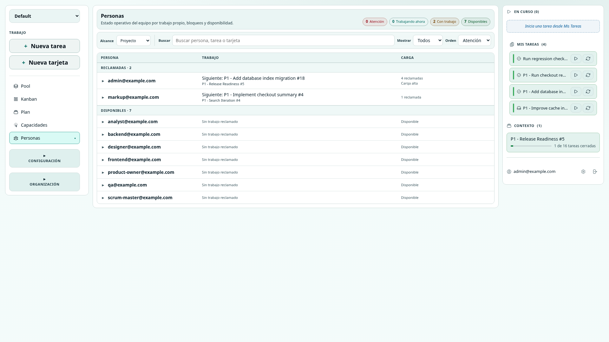
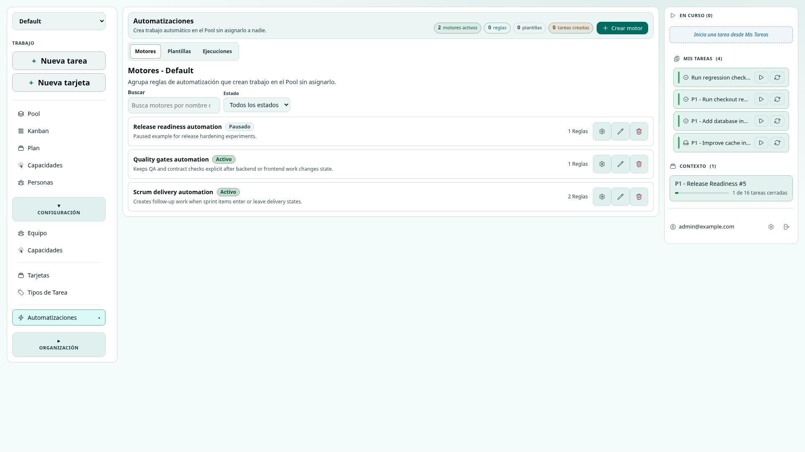
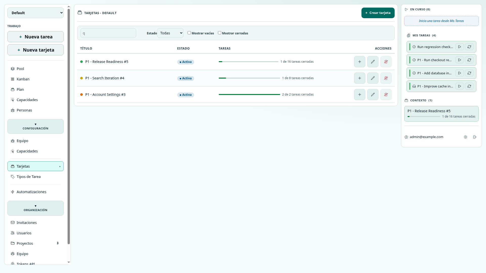

# Manual de usuario de ScrumBringer

**Version:** 1.1  
**Fecha:** 2026-06-29  
**Audiencia:** miembros de equipo, managers de proyecto y administradores de organizacion  
**Capturas:** entorno local de desarrollo con datos demo, navegador 1920x1080

---

## Tabla de contenidos

1. [Que propone ScrumBringer](#que-propone-scrumbringer)
2. [Primer acceso](#primer-acceso)
3. [El mapa mental: tarjetas, tareas y capacidades](#el-mapa-mental-tarjetas-tareas-y-capacidades)
4. [Modelar un proyecto](#modelar-un-proyecto)
5. [Trabajar dia a dia](#trabajar-dia-a-dia)
6. [Leer avance y salud](#leer-avance-y-salud)
7. [Encontrar bloqueos](#encontrar-bloqueos)
8. [Disenar flujos](#disenar-flujos)
9. [Configurar equipo y permisos](#configurar-equipo-y-permisos)
10. [Si vienes de Monday, Jira o Redmine](#si-vienes-de-monday-jira-o-redmine)
11. [Glosario](#glosario)

---

## Que propone ScrumBringer

ScrumBringer organiza el trabajo alrededor de un **Pool compartido**. Las tareas aparecen ahi con prioridad, tipo, tarjeta y capacidad. Las personas las reclaman cuando pueden hacerse responsables.

La idea es sencilla: el equipo no necesita que alguien empuje cada tarea hacia una persona. Necesita que el trabajo este visible, que las dependencias se vean pronto y que cada persona pueda elegir el siguiente paso con contexto suficiente.

Por eso ScrumBringer separa tres preguntas que en otras herramientas suelen mezclarse:

- **Que hay que conseguir?** Se modela con tarjetas.
- **Que trabajo concreto hay que hacer?** Se modela con tareas.
- **Quien puede asumirlo?** Se modela con capacidades y reclamacion desde el Pool.

El manager no pierde visibilidad. La gana desde otro lugar: ve estructura, avance, bloqueos, carga por persona y acumulacion por capacidad sin convertir el dia a dia en asignaciones manuales.

---

## Primer acceso

Abre la URL de ScrumBringer e inicia sesion con tu email y contrasena. Si recibiste una invitacion, usa el enlace de invitacion para crear tu contrasena antes de entrar.

*Figura 1: pantalla de acceso a ScrumBringer.*

Al entrar, revisa el proyecto seleccionado en la navegacion lateral. La mayor parte del trabajo diario ocurre dentro de un proyecto concreto.

Si olvidas la contrasena, usa **Olvidaste la contrasena?** desde la pantalla de acceso. En entornos sin envio de correo, ScrumBringer puede mostrar un enlace manual de restablecimiento.

---

## El mapa mental: tarjetas, tareas y capacidades

Antes de crear trabajo conviene entender una diferencia importante.

Una **tarjeta** no es necesariamente una tarea grande. Es un contenedor de contexto. Puede representar una iniciativa, fase, sprint, modulo, historia padre, hito o entregable. Cada proyecto decide que significa cada nivel de tarjetas.

Una **tarea** es trabajo ejecutable. Debe poder reclamarla una persona, empezarla, pausarla, liberarla o cerrarla.

Una **capacidad** representa el tipo de conocimiento necesario para una tarea: Backend, Frontend, QA, Product, Design, Security u otra especialidad real del equipo.

Con esas tres piezas ScrumBringer evita una trampa habitual: usar columnas, estados o responsables para explicar cosas distintas. La tarjeta da contexto, la tarea define el trabajo y la capacidad ayuda a que llegue a la persona adecuada sin asignacion directa.

---

## Modelar un proyecto

Un proyecto empieza por su jerarquia de tarjetas. Esa jerarquia debe parecerse a como el equipo habla del trabajo.

Por ejemplo, un proyecto puede usar esta estructura:

1. **Entregable:** `Nuevo onboarding`.
2. **Fase o area:** `Definicion`, `Implementacion`, `QA`.
3. **Tareas:** `Redactar criterios`, `Implementar formulario`, `Probar recuperacion`.

Otro proyecto puede preferir:

1. **Sprint:** `Sprint 24`.
2. **Historia:** `Registro por invitacion`.
3. **Tareas:** `Crear endpoint`, `Conectar formulario`, `Validar errores`.

No hay una unica jerarquia correcta. Lo importante es que las tarjetas representen contexto estable y las tareas representen trabajo que alguien puede completar.

La vista **Plan** muestra esa estructura y permite leer el proyecto por niveles. Es la pantalla adecuada para entender donde vive cada pieza de trabajo y que parte de la jerarquia estas mirando.

*Figura 2: Plan muestra la jerarquia de tarjetas y el trabajo asociado.*

Si tu equipo habla de entregables, una tarjeta puede ser el entregable. No necesitas una vista separada de entregables para empezar. Puedes crear un nivel de tarjetas con ese sentido y despues usar Plan, Kanban, Capacidades y Personas para leerlo desde distintos angulos.

---

## Trabajar dia a dia

El dia empieza en el **Pool**. Ahi aparece el trabajo abierto que el equipo puede reclamar. Antes de tomar una tarea, revisa su prioridad, tipo, tarjeta, capacidad y posibles bloqueos.

*Figura 3: Pool con tareas abiertas, filtros y acceso al detalle.*

Para reclamar trabajo:

1. Entra en **Pool**.
2. Filtra si necesitas acotar por tipo, capacidad o estado.
3. Abre una tarea si necesitas mas contexto.
4. Pulsa **Reclamar** cuando puedas hacerte responsable.

La tarea pasa a **Mis tareas**. Eso no significa que este activa ahora mismo. Significa que esta bajo tu responsabilidad temporal.

Cuando vayas a trabajar en ella, pulsa **Empezar**. ScrumBringer distingue entre tener trabajo reclamado y tener un foco activo. Esa separacion ayuda a que el equipo vea la diferencia entre cola personal y trabajo realmente en curso.

Si interrumpes el trabajo pero sigues siendo la persona responsable, pulsa **Pausar**. Si no puedes continuar o tiene mas sentido que otra persona la tome, pulsa **Liberar**. Liberar no es un fallo; es devolver trabajo visible al equipo.

Cuando completes el trabajo, pulsa **Cerrar tarea**. El cierre alimenta el avance de las tarjetas y las lecturas de salud.

*Figura 4: detalle de una tarea con acciones, notas y dependencias.*

---

## Leer avance y salud

ScrumBringer no necesita un porcentaje manual para saber como avanza una tarjeta. El avance se deriva del trabajo real: cuantas tareas hay, cuantas estan cerradas, cuantas siguen abiertas y cuantas estan bloqueadas.

En el detalle de una tarjeta puedes ver ese resumen operativo. Si una tarjeta representa un entregable, esa lectura funciona como avance del entregable. Si representa un sprint, funciona como lectura del sprint. Si representa una fase, funciona como lectura de esa fase.

*Figura 5: detalle de tarjeta con progreso, tareas y senales de salud.*

Usa cada vista para una pregunta distinta:

- **Plan:** donde esta el trabajo dentro de la jerarquia.
- **Kanban:** que tarjetas estan por iniciar, activas o cerradas.
- **Capacidades:** que especialidades concentran trabajo disponible, reclamado, en curso o bloqueado.
- **Personas:** quien tiene foco activo, carga acumulada o senales de atencion.
- **Metricas:** como evoluciona la salud operativa del flujo.

La vista de **Capacidades** es especialmente importante. Si vienes de herramientas donde el flujo se dibuja con columnas, aqui conviene mirar tambien si el siguiente trabajo esta llegando a la capacidad correcta.

*Figura 6: Capacidades agrupa el trabajo por especialidad y estado operativo.*

La vista de **Metricas** no sustituye a Plan, Pool o Personas. Sirve para leer tendencias de flujo y salud general. Para gestionar una entrega concreta, combina la tarjeta correspondiente con las vistas de trabajo.

*Figura 7: Metricas complementa la lectura operativa del proyecto y la organizacion.*

---

## Encontrar bloqueos

Una tarea esta bloqueada cuando depende de otro trabajo abierto o cuando necesita resolver una condicion previa. En ScrumBringer conviene registrar ese bloqueo como dependencia entre tareas siempre que sea posible.

Las tarjetas no se bloquean como un interruptor manual. Muestran **senales de bloqueo** cuando el trabajo que contienen esta bloqueado. Por eso, si una tarjeta representa un entregable, puedes abrir su detalle y ver si hay tareas bloqueadas dentro de ese entregable.

Para revisar bloqueos de una parte del proyecto:

1. Abre la tarjeta que representa el entregable, sprint, fase o historia.
2. Revisa el resumen de tareas.
3. Filtra o abre las tareas bloqueadas.
4. Entra en la tarea para ver de que depende.
5. Usa notas si el bloqueo necesita contexto adicional.

La vista **Personas** tambien ayuda. Muestra carga, foco y senales de trabajo bloqueado desde el punto de vista del equipo. Es util cuando la pregunta no es "que tarjeta esta bloqueada?", sino "a quien esta afectando este bloqueo?".

*Figura 8: Personas ayuda a detectar carga, foco y bloqueos que afectan al equipo.*

Si necesitas una lectura rapida de bloqueos, empieza por Pool con el filtro de bloqueadas. Si necesitas entender el impacto, mira Personas. Si necesitas entender el alcance, abre la tarjeta correspondiente.

---

## Disenar flujos

En ScrumBringer un flujo no se disena moviendo el mismo elemento por columnas. Se disena creando el siguiente trabajo cuando ocurre algo relevante.

Imagina este flujo:

`Desarrollo -> QA -> Documentacion -> Hecho`

En ScrumBringer lo modelas asi:

1. Una tarjeta guarda el contexto de la feature o entregable.
2. Una tarea de desarrollo aparece en el Pool con capacidad Backend o Frontend.
3. Al cerrarse, una automatizacion crea una tarea de QA.
4. Al cerrarse QA, otra automatizacion puede crear una tarea de Documentacion.
5. Cada tarea nueva queda en el Pool para que alguien con la capacidad adecuada la reclame.

La diferencia es importante. No estas empujando un item por una tuberia. Estas haciendo visible el siguiente trabajo ejecutable en el momento correcto.

*Figura 9: Automatizaciones crea trabajo nuevo en el Pool sin asignarlo a una persona.*

Para crear o revisar un flujo:

1. Entra en **Configuracion > Automatizaciones**.
2. Revisa los motores activos.
3. Define plantillas de tarea con tipo, prioridad, tarjeta y capacidad.
4. Crea reglas que conecten eventos con plantillas.
5. Comprueba las ejecuciones.
6. Vuelve a Pool y Capacidades para verificar que el trabajo aparece donde debe.

Las automatizaciones deben crear trabajo claro. Evita usarlas para asignar personas de forma silenciosa.

---

## Configurar equipo y permisos

Los managers de proyecto configuran el equipo, las capacidades, los tipos de tarea, las tarjetas y las automatizaciones del proyecto. Los administradores de organizacion gestionan usuarios, proyectos, invitaciones, tokens API y metricas de organizacion.

*Figura 10: configuracion de tarjetas del proyecto.*

Al configurar un proyecto, empieza por pocas decisiones claras:

1. Define que significa cada nivel de tarjeta.
2. Crea las capacidades que el equipo usa de verdad.
3. Crea tipos de tarea que ayuden a filtrar y entender el trabajo.
4. Anade personas al proyecto y asigna sus capacidades.
5. Crea automatizaciones solo cuando el flujo ya esta entendido.

Mantener pocas capacidades suele funcionar mejor que crear una capacidad para cada detalle. Si una capacidad no ayuda a reclamar trabajo, probablemente es demasiado fina.

Roles principales:

- **Org admin:** gestiona la organizacion, proyectos, usuarios, invitaciones, tokens y metricas.
- **Manager de proyecto:** configura equipo, capacidades, tarjetas, tipos de tarea y automatizaciones.
- **Miembro de proyecto:** ve trabajo, reclama tareas, usa notas, revisa vistas y participa en el flujo.

Algunas acciones tienen impacto alto: eliminar miembros, cerrar tarjetas, borrar capacidades, revocar tokens o liberar trabajo de otra persona. Usalas con contexto compartido.

---

## Si vienes de Monday, Jira o Redmine

La forma mas facil de adoptar ScrumBringer es no copiar literalmente el modelo anterior. Traduce la intencion.

| Si buscas... | En ScrumBringer se resuelve asi... |
| --- | --- |
| Un entregable padre | Una tarjeta de nivel alto, con subtareas o subtarjetas. |
| Fases de trabajo | Subtarjetas, tipos, capacidades y automatizaciones. |
| Porcentaje de avance | Tareas cerradas frente a tareas totales de una tarjeta. |
| Un dashboard de sprint | Lectura combinada de tarjeta, Plan, Pool, Capacidades, Personas y Metricas. |
| Responsables por tarea | Tareas reclamadas por quien las asume. |
| Bloqueos de tarjeta | Senales derivadas de tareas bloqueadas dentro de la tarjeta. |
| Flujo tipo Monday | Automatizaciones que crean el siguiente trabajo en el Pool. |

### El caso Monday: crear un flujo

En Monday es habitual disenar un proceso con paneles, columnas y estados. Por ejemplo, un item cambia de `Desarrollo` a `QA` y despues a `Documentacion`.

En ScrumBringer, la tarjeta conserva el contexto y las tareas representan cada paso ejecutable. Al cerrar desarrollo, aparece QA. Al cerrar QA, aparece documentacion. La vista de Capacidades muestra si esas tareas estan llegando a las especialidades correctas.

Esta forma de trabajar evita que una columna parezca avance cuando todavia no hay una persona lista para hacer el siguiente trabajo.

### Patrones que conviene evitar

Evita trasladar estos habitos sin revisarlos:

- Crear una tarjeta por cada estado del proceso.
- Usar capacidades como nombres de personas.
- Mantener muchas tareas reclamadas como cola personal.
- Medir salud solo por columnas.
- Crear automatizaciones que asignan trabajo a alguien.

ScrumBringer funciona mejor cuando el trabajo esta visible, es reclamable y mantiene claro por que capacidad debe pasar.

---

## Glosario

**Bloqueo:** situacion que impide avanzar una tarea, normalmente por una dependencia abierta.

**Capacidad:** especializacion asociada a tareas y personas.

**En curso:** tarea que es foco activo de una persona.

**Entregable:** unidad de valor o resultado esperado. En ScrumBringer suele representarse como una tarjeta.

**Liberar:** devolver una tarea reclamada al Pool.

**Metricas:** lectura de salud operativa y tendencias de flujo.

**Pool:** espacio compartido donde aparecen tareas abiertas disponibles para reclamar.

**Reclamar:** asumir temporalmente una tarea.

**Tarjeta:** contenedor de contexto dentro de la jerarquia del proyecto.

**Tarea:** unidad de trabajo que una persona puede reclamar, ejecutar y cerrar.

**Workflow:** automatizacion que crea trabajo nuevo en el Pool cuando ocurre un evento definido.
